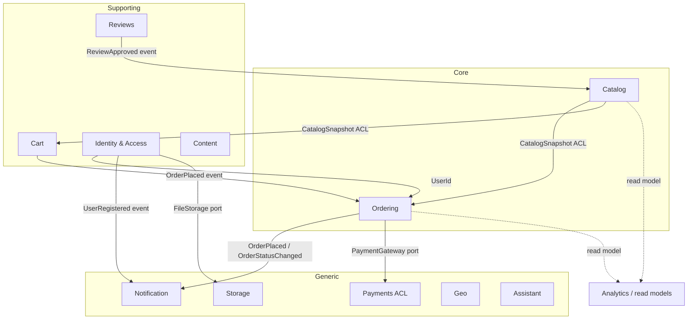

# Gearly Backend — Domain-Driven Design Refactoring Plan (Sprints 8–13)

> **Format:** Solo-developer sprints, continuing the numbering and cadence of [`REFACTORING_SPRINT_PLAN.md`](./REFACTORING_SPRINT_PLAN.md) (S1–S7, complete). One-week cadence (≈4 focused dev-days/sprint). Each sprint ends on a **green build**, so any sprint is a safe stopping point. One sprint branch at a time (`ddd/sN-<theme>`); commit per checklist item so regressions are bisectable.

---

## Why this refactor

Sprints S1–S7 cleaned the backend **tactically**: secrets externalized, global error handling, god-services split, a `mapper/` layer, the Bookify→Gearly rename, a 51-test safety net, DTO-only responses. What they did not change is the **architecture**.

A survey of all 190 Java files confirms the backend is still a textbook **anemic layered application**:

| Symptom | Evidence |
|---|---|
| **Maximally anemic model** | 19 `@Document` classes; **exactly one behavior method** in the whole `model/` package (`TimeFrame.getStartInstant`, `model/TimeFrame.java:14`). Every entity is a Lombok `@Getter @Setter` data bag with a fully public setter surface. |
| **Invariants live in services** | The order state machine is a static map on `AdminOrderService` (`service/admin/AdminOrderService.java:36-51`) — and is **bypassable through three other write paths**: `patchOrder:83`, `OrderMapper.applyUpsert:38`, `updateOrderStatusFromMomo:232`. |
| **Zero value objects** | Money is `double` on every persisted field but `BigDecimal` in the calculation layer, round-tripped lossily at `CustomerOrderService.java:150`. Rating is an unbounded `int` (a rating of `900` is accepted). IDs are `String` except `Review`'s `ObjectId`. Timestamps are `Instant` / `Date` / `LocalDateTime` / **`String`** depending on the class. |
| **Duplicated rules** | The stock check exists in **five** places. `CustomerOrderService.cancelOrder` contradicts `AdminOrderService`'s transition table (`PENDING→PENDING_REFUND` vs `DELIVERED→PENDING_REFUND`). |
| **No consistency guarantees** | All **7 `@Transactional` annotations are inert** — there is no `MongoTransactionManager` bean and Mongo runs standalone. `createOrder` can leave an order placed with stock only partially decremented. No `@Version` anywhere, so two concurrent checkouts can both pass the stock check and oversell. |
| **No domain events** | Zero `ApplicationEventPublisher` / `@EventListener` usage. Email sends, stock decrements, and cart clears are hard synchronous calls inside nominal transaction scopes. |

**Goal:** restructure the backend into **bounded contexts with rich aggregates that cannot be put into an illegal state**, and make that structure *strict* — enforced by **ArchUnit fitness functions**, not by convention.

### Two hard constraints shaping every decision

1. **`mapper/ResponseDtoWireCompatTest.java` pins the JSON wire format byte-for-byte** to the current document shape. Both frontends depend on it.
2. **There is no migration framework** (no Flyway/Liquibase/Mongock). Schema changes mean appending idempotent, type-guarded steps to `backend/data/seed/migrate.js`, following the pattern proven in S7.

### Confirmed direction (decisions taken)

| Decision | Choice | Consequence |
|---|---|---|
| **Domain ↔ persistence** | **Rich `@Document` aggregates + Mongo custom converters** | Aggregates keep `@Document` but gain private setters, behavior, and value objects. `MongoCustomConversions` writes `Money` as a plain `double` and `ProductId` as a `String`, so **the DB shape and the JSON wire shape stay byte-identical**. No third mapping layer, no migration for the VO introduction. |
| **Consistency** | **Single-node replica set + `MongoTransactionManager`** | Makes the existing `@Transactional` annotations real. Plus `@Version` optimistic locking on `Product`/`Order`/`Cart` to close the oversell race. |
| **Interfaces / ports** | **Repository ports + external-system ports only** | Honors S3's "no service interfaces" decision. Application and domain services stay plain `@Service` classes; only `OrderRepository`, `PaymentGateway`, `NotificationSender`, `FileStorage`, `ExchangeRateProvider` etc. become interfaces. |

---

## Target architecture

```
com.dominator.gearly
├── shared/domain            Money, Quantity, Rating, EmailAddress, PhoneNumber,
│                            PersonName, Slug, typed IDs, AggregateRoot, DomainEvent
├── shared/infrastructure    MongoCustomConversions, Jackson module
│
├── ordering/    {domain, application, infrastructure, api}   ← CORE
├── catalog/     {domain, application, infrastructure, api}   ← CORE
├── cart/        {domain, application, infrastructure, api}
├── reviews/     {domain, application, infrastructure, api}
├── identity/    {domain, application, infrastructure, api}
│
├── payments/     {domain (ports), infrastructure (MoMo, FX)}  ← ACL
├── notification/ {domain (port), infrastructure (SMTP)}
├── storage/      {domain (port), infrastructure (local disk)}
├── geo/ content/ assistant/
│
├── analytics/               the ONLY package allowed to use MongoTemplate (query side)
└── platform/                config, security, exception (cross-cutting)
```

### Context map



**Relationship styles:** Catalog→Ordering and Catalog→Cart are **customer/supplier with an anti-corruption layer** (`CatalogSnapshot`) — the downstream contexts copy price/title at capture time and never hold a `Product`. Reviews→Catalog is **event-driven**. Payments/Notification/Storage/FX are **generic subdomains behind ports**.

### Layer rules — enforced by ArchUnit, tightened each sprint

- `..domain..` may import only: JDK, Lombok `@Getter`, `org.springframework.data.annotation.*`, `org.springframework.data.mongodb.core.mapping.*`.
  **Banned in `..domain..`:** `org.springframework.web..`, `org.springframework.security..`, `org.springframework.http..`, `org.springframework.data.mongodb.repository..`.
- `..api..` must not depend on `..infrastructure..`.
- No cross-context dependency except via `shared..`, a published domain event, or a named port.
- No `@Document` class outside `..domain..`.
- No public setter on an aggregate root.
- `MongoTemplate` may only be referenced from `analytics..`.

---

## Sprint map at a glance

| Sprint | Theme | Est. | Risk | Ships |
|---|---|---|---|---|
| **S8** | Strategic design & guardrails | ~4 d | Med | Context map, ArchUnit, real transactions, `@Version`, characterization tests |
| **S9** | Shared kernel (VOs, typed IDs, converters) | ~4 d | Med | `Money`/`Rating`/`Quantity`/typed IDs — DB + wire shape unchanged |
| **S10** | Ordering context (core domain) | ~4.5 d | **High** | Rich `Order`, state machine on the aggregate, `PricingPolicy`, domain events |
| **S11** | Catalog & Cart contexts | ~4 d | Med | One stock rule, `Cart` behavior, catalog ACL, price-tamper fix |
| **S12** | Reviews & Identity/Access | ~4 d | Med | Review lifecycle, `User` aggregate, security out of the domain, 4 security fixes |
| **S13** | Supporting contexts & closeout | ~4 d | Low–Med | Payment/FX/email/storage ports, analytics as query side, ArchUnit repo-wide |

**Dependency order is strict: S8 → S9 → S10 → S11 → S12 → S13.**
S8 must land first — S10–S12 rewrite three services that have **zero test coverage today**, and the characterization suite is the only thing that makes that safe.

---

## Cross-cutting working agreements

Inherits everything from `REFACTORING_SPRINT_PLAN.md` §"Cross-cutting working agreements", plus:

- **One aggregate per transaction.** Anything crossing aggregates goes through a domain event.
- **Reference other aggregates by typed ID only**, never by object reference.
- **Snapshot semantics are deliberate.** `OrderLine` and `CartLine` copy price/title at capture time (already the behavior — documented at `mapper/OrderMapper.java:10-13`). Formalize as `CatalogSnapshot`.
- **The S8 characterization suite is the contract.** Every later sprint must leave it green. A deliberate behavior change means editing that test **in the same commit**, with the rationale in the commit message.
- **`ResponseDtoWireCompatTest` must stay green throughout.** Any intentional break is its own checklist item with a companion frontend task.
- **Definition of Done (per sprint):** the S1–S7 DoD *plus* ArchUnit green *plus* the characterization suite green.
- **Branch:** `ddd/s8-foundations`, `ddd/s9-shared-kernel`, … Self-review diff pass before merging.

---

## Sprint 8 — Strategic design & guardrails
**Goal:** Agree the context map, stand up the package skeleton and fitness functions, make transactions real, and get a safety net under the three fat untested services **before** touching them.

**Backlog**
- [x] **Characterization tests first — the highest-value item in the whole program.** `CustomerOrderService` (240 L), `CartService` (236 L), and `ReviewService` (163 L) are the primary extraction targets and have **zero coverage today**. Write `CustomerOrderServiceTest` (8% tax, the >$30 free-shipping threshold, cancel-paid vs cancel-unpaid, MoMo status update), `CartServiceTest` (add / update / merge / stock-clamp / `syncCartWithStock`), `ReviewServiceTest` (`applyRating` rollup). **Lock current behavior exactly, bugs included.**
- [x] **Context map + package skeleton:** create the context packages with a `package-info.java` each, stating the context's responsibility and its relationships. No code moves yet.
- [x] **ArchUnit:** add `com.tngtech.archunit:archunit-junit5` (test scope) + `ArchitectureFitnessTest`. Rules scoped to the new packages only, so the test is green on day one and tightens each sprint.
- [x] **Make `@Transactional` real:** `--replSet rs0` + a one-shot `rs.initiate()` in `docker-compose.yml`; a `MongoTransactionManager` bean in `platform/config`. Testcontainers' `MongoDBContainer` already starts a single-node replica set, so integration tests get real transactions for free.
- [x] **Fix the self-invocation bug:** `CustomerOrderService.java:189` — `createOrderAndGetMomoUrl` calls `createOrder` through `this`, bypassing the proxy, so the inner `@Transactional` never applies.
- [x] **Optimistic locking:** `@Version` on `Product`, `Order`, `Cart` — closes the read-then-write oversell race at `ProductService.java:52-59`. Map `OptimisticLockingFailureException` → **409** in `GlobalExceptionHandler`.
- [x] **Docs:** update `backend/README.md` + `backend/Makefile` for the replica-set requirement.

**Verify:** `mvn test` green with the new characterization tests; `rs.status().ok` returns 1; an integration test that injects a mid-flow exception into `createOrder` proves **both** the order *and* the stock decrement roll back.

**Risks:** the replica-set change breaks a plain `mongo` local setup until `rs.initiate()` runs — the Makefile and README must cover it. Existing data files work unchanged.

### S8 outcome — shipped

Branch `ddd/s8-foundations`, seven commits. **147 tests green** (51 before the sprint).

| Item | Landed as |
|---|---|
| Characterization suites | 78 tests across the three services; 12 current bugs pinned and labelled `KNOWN BUG` with the sprint expected to change each |
| Context map | 60 `package-info.java` files; no production class moved |
| ArchUnit | `ArchitectureFitnessTest`, 10 rules; each verified by planting a deliberate violation and confirming it fails |
| Real transactions | `platform/config/TransactionConfig`; `--replSet rs0` with the healthcheck as an idempotent `rs.initiate()`; `directConnection=true` |
| Self-invocation | placement routed through an `ObjectProvider` self-reference; the MoMo call moved outside the transaction |
| Optimistic locking | `@Version` (`@JsonIgnore`d) on the three aggregates, 409 mapping, `migrate.js` backfill + updated seed dumps |

**Verification actually performed**, not just asserted:

- `rs.status().ok` → `1`, one `PRIMARY` member.
- `OrderPlacementTransactionIntegrationTest` proves the rollback against a real replica
  set — and the assertion was shown to be **non-vacuous** by removing the
  `MongoTransactionManager` bean and confirming it fails with the order still present.
- A positive control commits both the order and the stock decrement, so the rollback
  test cannot pass for the wrong reason.
- `ResponseDtoWireCompatTest` is green **unchanged** — `@JsonIgnore` on `version` keeps
  the entity's JSON identical, so neither frontend sees a wire change.

**Deviations from the plan as written, and why:**

1. **`createOrderAndGetMomoUrl` also lost its own `@Transactional`.** The plan scoped
   this item to "make the inner `@Transactional` apply". Simply fixing the proxy call
   would have left an external HTTP request to MoMo running inside an open database
   transaction. The transaction now belongs to `createOrder` alone — one aggregate, one
   transaction — which is the state S10 completes by moving the gateway call to an
   `AFTER_COMMIT` listener.
2. **`@Version` needed a data migration the plan did not anticipate.** Spring Data treats
   a `null` version as "not yet persisted", so a pre-S8 document would have its first
   `save()` issued as an *insert* and die on the duplicate `_id`. `migrate.js` step 6
   backfills `version: 0` and the seed dumps carry it. Covered by a test.
3. **The concurrent-checkout proof landed early.** The plan lists it under S11's verify
   step, but S8 is where `@Version` is introduced, so the deterministic two-reader race
   test ships here.

**Carried into later sprints (not S8 gaps):** the ArchUnit `SCOPE:` markers come off in
S13; the `ObjectProvider` self-reference seam disappears in S10.

---

## Sprint 9 — Shared kernel: value objects, typed IDs, converters
**Goal:** Introduce the type vocabulary the aggregates will be written in, **without changing a single byte in Mongo or on the wire.**

**Backlog**
- [x] **`shared/domain` value objects:** `Money` (BigDecimal + Currency, scale 2 HALF_UP, `plus`/`minus`/`times`/`isGreaterThan`) replacing `double` on `Order.totalAmount:27`, `OrderItem.price`, `CartItem.price`, `Product.price`/`originalPrice`, `Transaction.amount`. Plus `Quantity` (non-negative), **`Rating` (1–5, validated)** — today `CreateReviewRequestDTO` has no bounds and `applyRating` will happily fold in a rating of `900`. Plus `ProductRating` (count/total/average as one invariant), `EmailAddress`, `PhoneNumber`, `PersonName`, `Slug`.
- [x] **Kill the `fullName` split:** `PersonName` derives `fullName`, resolving the two sources of truth between `UserService.java:35` (computes it) and `AuthService.java:85` (takes it from the client).
- [x] **Typed IDs:** `ProductId`, `OrderId`, `UserId`, `CartId`, `ReviewId`, `CategoryId` as records over `String`. `CategoryId` absorbs the `ObjectId`↔`String` asymmetry currently patched in `ProductMapper.java:117`; `Review`'s three `ObjectId` fields normalize here.
- [x] **Enums:** `Role` (replaces the stringly-typed `User.role`, consumed at `AuthenticatedUser.java:22`), `ProductCondition` (replaces the free-text `condition` matched by string equality at `ProductRepositoryCustomImpl.java:31`).
- [x] **`shared/infrastructure/DomainTypeConverters`** — a `MongoCustomConversions` bean with read/write converter pairs: `Money↔Double`, `Quantity↔Integer`, `Rating↔Integer`, `ProductId↔String`, `CategoryId↔ObjectId`, `EmailAddress↔String`. **This is the load-bearing piece — document shape is unchanged.**
- [x] **Jackson module** with matching `@JsonValue`/`@JsonCreator` so DTO serialization is unchanged. Extend `ResponseDtoWireCompatTest` to cover the VO-carrying DTOs.
- [x] **Timestamp normalization** (mirroring the proven S7 `Product` pattern): `Category.addedAt/modifiedAt` and `Review.addedAt/modifiedAt` `String`→`Instant`; `Cart` `Date`→`Instant`; `VerificationToken` `LocalDateTime`→`Instant`. Add idempotent, type-guarded `$toDate` steps to `data/seed/migrate.js` and update the seed dumps. Note `ReviewService.java:61` currently sorts reviews by a *String* date.
- [x] **Tests:** VO unit tests (rating 0 and 6, malformed email, negative quantity all rejected); a `@DataMongoTest` round-trip asserting the **stored BSON types** are unchanged.

**Verify:** dump a document with `mongosh` before and after and diff — identical. Wire-compat test green. `grep -rn "double price\|double totalAmount" backend/src/main` returns nothing.

**Risks:** a missed converter surfaces as a mapping exception at boot — caught by `GearlyApplicationTests.contextLoads`. The timestamp normalization touches live data; migrate.js steps must be idempotent and type-guarded like S7's.

### S9 outcome — shipped

Branch `ddd/s9-shared-kernel`, five commits. **267 tests green** (240 after the kernel
landed, 147 before the sprint).

| Item | Landed as |
|---|---|
| Value objects | `Money`, `Quantity`, `Rating`, `ProductRating`, `EmailAddress`, `PhoneNumber`, `PersonName`, `Slug` — 93 unit tests |
| Typed IDs | `ProductId`, `OrderId`, `UserId`, `CartId`, `ReviewId`, `CategoryId` over a shared `DomainId` |
| Enums | `Role`, `ProductCondition` |
| Converters | `DomainTypeConverters` (14 pairs) + `ObjectIdBackedIdConverters` for the per-property cases |
| Jackson | `@JsonValue`/`@JsonCreator` on the kernel types — no separate module needed, see below |
| Timestamps | `Category`/`Review` `String`→`Instant`, `Cart` `Date`→`Instant`, `VerificationToken` `LocalDateTime`→`Instant`; `migrate.js` step 7 + regenerated dumps |
| `fullName` split | `User.setName(PersonName)` writes all three fields; `AuthService` stops trusting the client's `fullName` |

**Verification actually performed**, not just asserted:

- `DomainTypeBsonRoundTripTest` reads the **raw `org.bson.Document`**, bypassing the entity
  mapping, and asserts the concrete stored class of each field. A save-then-load test
  could not do this: it would pass just as happily with `Money` stored as a nested
  document, because it would read back the same way.
- Shown **non-vacuous** the way S8 proved its rollback test — removing
  `MoneyToDoubleConverter` from the registration makes 5 of them fail with the value
  stored as `{amount, currency}`. Restored, all green.
- The wire format is pinned by **literal JSON assertions**, not by the DTO-equals-entity
  tests. Those compare the two representations to *each other*, so they stayed green
  through the whole `double`→`Money` change and would have stayed green even if `Money`
  had serialized as an object. `price` is still `1599.0`, a `DoubleNode` — a `BigDecimal`
  `@JsonValue` would have written `1599.00`.
- The migration was run against a **real `mongo:6.0` with the actual seed dumps**: 10
  categories and 91 reviews converted, zero warnings, second run a no-op, no date outside
  2020–2030 (which would betray a month/day transposition), dumps re-exported and
  re-imported clean.
- `grep -rn "double price\|double totalAmount" backend/src/main` returns nothing.

**What running it for real caught that the plan did not anticipate:**

`reviews` holds a **third** timestamp format — `"6/9/25, 3:42 AM"`, an en-US
`toLocaleString()` value, in 40 of 91 documents. It matters twice over:

1. Unlike the two ISO shapes, it does **not** coerce into an `Instant` on read. Without
   the migration, 44% of the reviews collection becomes unreadable the moment the field
   type changes. Both facts are pinned as tests.
2. It forced the implementation. The first version of step 7 was an aggregation pipeline
   and **aborted mid-collection** on the first such document: `$dateFromString` has no
   specifier for a 12-hour clock or an AM/PM marker (no `%I`, no `%p`). Step 7 is now a
   client-side pass that assembles values with `Date.UTC`, which also makes the result
   independent of the operator's timezone — for a zone-less string, `new Date(str)` would
   silently shift it by the local offset.

**Deviations from the plan as written, and why:**

1. **No separate Jackson module.** The plan asked for one "with matching
   `@JsonValue`/`@JsonCreator`". Every type needing it is ours, so the annotations live on
   the kernel types directly. A module would have been a second place to keep in sync with
   no behavior it could add.
2. **`Rating` and `ProductRating` ship without adopting a field.** `Review.rating` stays an
   `int` until S12: a legacy document holding the out-of-range rating the S8 suite pins as
   a `KNOWN BUG` must not become unreadable in the meantime. Folding `Product`'s three
   rating fields into one VO would change the stored shape, which S9 forbids — S11 does it.
3. **`EmailAddress` validates but does not normalize case.** `User.email` carries a unique
   index and is the login identifier, so lower-casing stored addresses is a migration with
   a duplicate-key failure mode, not a type change. Deferred to S12.
4. **`Role` and `ProductCondition` live in `shared/domain`,** not in `identity/` and
   `catalog/`. `DomainTypeConverters` needs both, and ArchUnit's
   `shared_kernel_depends_on_no_context` forbids the shared kernel importing a context.
5. **`ObjectIdBackedIdConverters` was not in the plan.** `ProductId` is stored as a
   `String` on an order line but as an `ObjectId` in `reviews.productId` — one Java type,
   two BSON forms. `MongoCustomConversions` registers per *type* and cannot express that;
   `@ValueConverter` applies per *property* and can.

**Two deliberate changes, both evidenced:**

- **`Product.categoryIds` on the wire.** A raw `ObjectId` serialized as
  `{"timestamp":…,"date":…}` — an unusable shape. It is now the hex string. Verified by
  grep across both frontends that neither reads `categoryIds`: they consume
  `categoryNames` and send category ids back as the `genres` query parameter, already
  as hex.
- **An unrecognized `condition` filter is now a 400** rather than a string-equality match
  that could only ever return nothing. The storefront only sends values from its own fixed
  list.

Review timestamps gain a `Z` suffix, which is a **fix**: `ProductReviews.jsx` parses them
with `new Date(addedAt)`, and a zone-less string is read as local time, so the displayed
date was shifted by the viewer's UTC offset.

**Carried into later sprints (not S9 gaps):** `Quantity`, `EmailAddress`, `PhoneNumber`
and `Slug` ship as vocabulary with converters and tests but no adopted field yet — the
aggregates that use them are built in S10–S12. `ProductSearchDTO.minPrice/maxPrice` stay
`double`, being range bounds on a query string rather than persisted money.

---

## Sprint 10 — Ordering context (core domain) ⚠️ highest logic churn
**Goal:** `Order` becomes a real aggregate root that **cannot be put into an illegal state.** Highest-value sprint of the program.

**Backlog**
- [ ] **Move + de-anemize:** `Order`, `OrderItem`→`OrderLine`, `Payment`, `Transaction`→`PaymentTransaction`, `ShippingInformation` into `ordering/domain`. **Drop the stray `@Document`** on the embedded types (they are never standalone collections — a copy-paste artifact). Remove `@Setter`/`@AllArgsConstructor`; private no-arg constructor for Spring Data.
- [ ] **`OrderStatus` owns the transition table:** move `ALLOWED_SOURCES` (`AdminOrderService.java:36-44`) onto the enum as `canTransitionTo(target)` / `assertCanTransitionTo(target)`; `TX_EFFECTS` moves onto `Order`.
- [ ] **Behavior onto the aggregate:** `Order.place(UserId, List<OrderLine>, ShippingInformation, PaymentMethod, PricingPolicy)`, `cancel(reason)`, `transitionTo(status)`, `recordPayment(tx)`, `markReviewed()`, `isOwnedBy(UserId)`. `Payment.isSettled()`, `Payment.initiateRefund(Money)` — replacing the feature-envy `CustomerOrderService.initiateRefund(order, payment)` at `:125-134`.
- [ ] **`PricingPolicy` domain service:** the four constants at `CustomerOrderService.java:41-44` become `@ConfigurationProperties("gearly.pricing")` bound into it. **Behavior preserved exactly:** 8% tax; subtotal > $30 → free shipping, else $15.
- [ ] **Close all three bypass paths:** `patchOrder:83` and `OrderMapper.applyUpsert:38` route status changes through `order.transitionTo(...)`; `updateOrderStatusFromMomo:232` uses `recordPayment` + `transitionTo`. Also **reconcile the contradiction** — `ALLOWED_SOURCES` says `PENDING_REFUND` comes only from `DELIVERED`, but `cancelOrder:105-118` drives `PENDING`/`PROCESSING → PENDING_REFUND`. The cancel path is the real rule: widen the table and encode it **once**. *Deliberate behavior change — update the S8 characterization test in the same commit.*
- [ ] **Also fix `patchOrder`:** it silently recomputes the order total from whatever items the client sent (`AdminOrderService.java:92-98`), with no relation to catalog prices. Route through the aggregate.
- [ ] **Keep the API stable:** `transition` now throws instead of returning `boolean`, but the application service catches and preserves the existing `ResponseEntity<Boolean>` contract on the seven `/api/admin/orders/{id}/set-*` endpoints — **no frontend change required.**
- [ ] **Ports:** `OrderRepository` interface in `ordering/domain`; `MongoOrderRepository` adapter in `ordering/infrastructure` wrapping Spring Data. `OrderRepositoryCustomImpl`'s criteria-building moves into the adapter.
- [ ] **Application layer:** `PlaceOrderService`, `CancelOrderService`, `OrderQueryService`, `AdminOrderService` — take command records and a `UserId`, **never** `AuthenticatedUser` (controllers unwrap; `CartController.java:25` already does this correctly).
- [ ] **Domain events:** an `AggregateRoot` base collects them. `OrderPlaced`, `OrderCancelled`, `OrderStatusChanged`, `PaymentRecorded`. `OrderPlaced` → `@TransactionalEventListener(BEFORE_COMMIT)` performs the stock decrement + cart clear **inside** the now-real transaction. The MoMo URL call moves to `AFTER_COMMIT`, so an external HTTP call is never inside a transaction (currently `CustomerOrderService.java:191`).
- [ ] **Relocate `service/common/PaymentFactory`** into `ordering/domain` — it is already a domain factory, just misfiled.
- [ ] **Tighten ArchUnit** onto `ordering..`.

**Verify:** the S8 characterization tests are green — that is the proof. `grep -rn "setOrderStatus" backend/src/main` returns zero hits outside `Order`. An illegal transition returns **409 from every path**, including `PATCH`.

**Risks:** **highest churn in the program** — entirely dependent on S8's safety net existing first. Split into compile-green steps: *move → encapsulate → extract policy → events*, compiling between each.

---

## Sprint 11 — Catalog & Cart contexts
**Goal:** One stock rule, one cart rule, and an anti-corruption layer between Catalog and the contexts that snapshot from it.

**Backlog**
- [ ] **`Product` root:** `reserve(Quantity)` / `restock(Quantity)` throwing `InsufficientStockException`; `addRating(Rating)` on a `ProductRating` VO; `changePrice(Money)`. This collapses **five duplicated stock checks** — `ProductService.java:52-59`, `CustomerOrderService.java:164`, and `CartService` at `:86-93`, `:106-113`, `:210-217` — into one rule on the aggregate.
- [ ] **Stop returning `null`:** `ProductService.getProductById:43` returns `null` on a miss, so `getStock` and `decreaseStock` NPE. Throw `ResourceNotFoundException`.
- [ ] **`Category`** into `catalog/domain`. The `@Transient categoryNames` read-model leak on `Product` moves to an application-layer projection. `ProductsInStockRepository`'s hard-coded `$lt: 10` **business rule in an annotation** becomes a `LowStockThreshold` config value.
- [ ] **`Cart` root:** `addLine`, `changeQuantity`, `removeLine`, `merge(Cart)`, `reconcileWith(List<CatalogSnapshot>)` — absorbing `syncCartWithStock` (`CartService.java:32-58`), `mergeCart` (`:169-191`), and the triplicated clamp. `CartItem`→`CartLine`. Enforce the `userId` XOR `guestId` rule that is currently unenforced.
- [ ] **ACL:** `CatalogSnapshot` + `ProductSnapshotPort`. Cart and Ordering never touch `Product` directly. `OrderMapper.toOrderItem` becomes `OrderLine.fromSnapshot(...)` — which also fixes its unguarded `getImages().getFirst()` (`OrderMapper.java:21`), a crash on any image-less product that `CartMapper.java:39-41` already guards against.
- [ ] **🔒 Security — price tampering.** `CartController.java:30`, `CartController.java:59`, and `GuestCartController.java:35` bind `@RequestBody CartItem` — a **persistence document** whose `price`, `title`, `stock`, and `condition` are client-controlled and persisted without re-reading the catalog. Replace with `AddCartItemRequestDTO { productId, quantity }` and hydrate from the catalog snapshot. *Frontend contract change: the body shrinks, extra fields are ignored — verify the storefront's add-to-cart call.*
- [ ] **Wishlist:** stays inside `User.favorites` for now, **documented as a deliberate aggregate choice**; splitting it into its own aggregate is logged as a follow-up.
- [ ] **Tighten ArchUnit** onto `catalog..` and `cart..`.

**Verify:** characterization + wire-compat tests green. A concurrent-checkout integration test proves `@Version` prevents overselling. Posting a tampered `price` in an add-to-cart body has no effect on what is stored.

**Risks:** Med — the cart request-DTO change is the one frontend-visible item in this sprint.

---

## Sprint 12 — Reviews & Identity/Access
**Goal:** Close the review-lifecycle holes, make `User` a real aggregate, and get Spring Security types out of the domain.

**Backlog**
- [ ] **`Review` root:** bounded `Rating` VO; `submit`, `approve()`, `reject()` with a `ReviewStatus` transition rule. Today `AdminReviewService.java:47-52` allows `APPROVED → PENDING`.
- [ ] **Fix the rating inconsistency.** `applyRating` (`ReviewService.java:155-162`) moves onto `Product.addRating(...)` and is driven by a **`ReviewApproved` domain event instead of firing at creation time.** Today `averageRating` counts reviews that were later *rejected*, while the public distribution query filters `status:'APPROVED'` (`ReviewRepository.java:23`) — the two numbers are structurally inconsistent. Add a `ReviewRejected` handler and a one-off recompute step in `migrate.js`. *Deliberate behavior change.*
- [ ] **Guard double-review:** `createReview` never reads `order.isReviewed()` even though `:132` writes it, so a repeated call **re-inflates** `ratingCount`/`totalRating`. Also require a reviewable order status — a `CANCELLED` or `PENDING` order is currently reviewable.
- [ ] **`identity/domain`:** `User` root with `Role`, `EmailAddress`, `PersonName`; `verify()`, `changePassword(...)`, `deactivate()`, `addFavorite`/`removeFavorite`. `VerificationToken`'s magic 30-minute TTL (`VerificationTokenService.java:34`) becomes config.
- [ ] **Access boundary:** remove `AuthenticatedUser` (a Spring Security `UserDetails`) from all service signatures — controllers unwrap to `UserId`. Replace `throw new ApiException(HttpStatus.FORBIDDEN, …)` inside the domain (`CustomerOrderService.java:102`, `ReviewService.java:141`) with `AccessDeniedDomainException`, mapped in `GlobalExceptionHandler`. Ownership becomes `order.isOwnedBy(userId)`. Enable `@EnableMethodSecurity` and use `@PreAuthorize` for role checks alongside the URL rules.
- [ ] **🔒 Four security bugs found during the survey — bundled here, each is small:**
  1. **IDOR:** `OrderController.java:59-62` `getOrderById` performs **no ownership check** — any authenticated user can read any order, including payment details and the buyer's shipping address.
  2. `SecurityConfig.java:53-56` permits `/api/reviews/**`, which also matches `POST /api/reviews/submit-review`; an anonymous POST NPEs into a **500 instead of a 401**.
  3. `JwtAuthenticationFilter.java:39` calls `extractEmail` *before* `validateToken:41`, so an expired or tampered token throws → **500 instead of 401**.
  4. `/api/guest-cart/**` is `permitAll` with a client-supplied `guestId` and no binding — **any guest cart is readable and mutable by anyone who knows the UUID.**
- [ ] **Events:** `UserRegistered` — the email side effect moves out of `AuthService.register:94` into an `AFTER_COMMIT` listener, so a mail send is no longer inside a nominal transaction boundary.
- [ ] **Tighten ArchUnit** onto `reviews..` and `identity..`.

**Verify:** fetching another user's order → 403; anonymous review POST → 401; expired token → 401; approve-then-reject leaves the product average correct; a rating of 0 or 6 → 400 with field errors.

**Risks:** Med. The rating recompute is a live-data change. Confirm no admin frontend call relied on the previously-open `getOrderById`.

---

## Sprint 13 — Supporting contexts, ACLs, read models & closeout
**Goal:** Every external system behind a port, the query side made explicit, ArchUnit tightened repo-wide.

**Backlog**
- [ ] **`payments/`:** `PaymentGateway` port + `MomoPaymentGateway` adapter. Inject `RestClient` as a bean instead of `new RestTemplate()` (`MomoService.java:24`, untestable as a `new`'d field). **De-duplicate the HMAC-SHA256 helper**, currently copy-pasted verbatim in `MomoService.java:95-108` and `PaymentController.java:109-122`. Move IPN signature verification out of the controller into the adapter and use a **constant-time compare** (`PaymentController.java:105-107` uses `.equals`). Guard the unchecked `Integer.parseInt` at `:70`.
- [ ] **`ExchangeRateProvider` port** + adapter — `FxService.java:27` currently swallows every exception into a silent, hard-coded 23000 VND rate.
- [ ] **`notification/`:** `NotificationSender` port + `SmtpNotificationSender`. Move the 120-line inline HTML into a template. **Base URLs from config** — `EmailService.java:17,31` hardcodes `http://localhost:8080` and `UserController.java:85-91` hardcodes `:5173`.
- [ ] **`storage/`:** one `FileStorage` port with a `LocalFileStorage` adapter, unifying `AvatarStorageService` and the raw `Files.createDirectories`/`Files.copy` sitting **inline in `MediaController.java:26-37` with no service layer at all**. Add content-type and size validation (avatars are currently saved as `{userId}.jpg` regardless of actual type).
- [ ] **`analytics/`:** make the CQRS split explicit — the **only** package permitted to use `MongoTemplate` (currently injected into `OrderAnalyticsService.java:40` and `AdminDashboardGetProductService.java:35`). Reads documents, returns DTOs, never touches domain objects. Fold away the pass-through `AdminDashboardService` (38 L of pure delegation).
- [ ] **`content/`** (BlogPost, StaticPage), **`geo/`** (Country/State/City — `AddressService.java:32-48` returns `null` via `.orElse(null)` into `int` fields, risking NPE; fix), **`assistant/`** (existing `ai/` + `websocket/` behind an `AiAssistant` port; log `ChatMemoryService`'s JVM-local `ConcurrentHashMap` as a scale-out follow-up, don't fix here).
- [ ] **Dead code:** delete `TransactionRepository` (injected nowhere), `ProductRepository.title(String)` at `:20` (a stray method with no Spring Data prefix that would fail parsing if called), and the duplicate `AdminCategoryController` / `CategoryController` pair (byte-identical endpoints on the same service call).
- [ ] **ArchUnit final tightening:** every rule now applies **repo-wide with no scoping**. This is what makes the result *strict* rather than aspirational.
- [ ] **Docs:** rewrite the `backend/README.md` architecture table for the context map; finalize this document; `package-info.java` per context.

**Verify:** `grep -rn "MongoTemplate" backend/src/main | grep -v analytics` is empty; `grep -rn "new RestTemplate()" backend/src/main` is empty; ArchUnit repo-wide green.

**Risks:** Low–Med, mostly mechanical moves — but the MoMo IPN relocation touches money. Verify against the MoMo sandbox before merging.

---

## Verification — end to end, every sprint

```bash
# Build — Java 21 must be pinned; the default JDK breaks Lombok
export JAVA_HOME=$(/usr/libexec/java_home -v21)
cd backend && mvn clean test            # must stay green (51 tests today + new suites)

# Full stack (Colima). Testcontainers needs ~/.testcontainers.properties and
# ~/.docker-java.properties present, or the container tests silently skip.
make -C backend up && make -C backend seed
mongosh "mongodb://localhost:27017/gearly" --eval 'rs.status().ok'

# S9 shape proof — dump before/after and diff; must be identical
mongosh gearly --eval 'JSON.stringify(db.orders.findOne())' > /tmp/before.json

# Smoke the money path end to end
curl -s localhost:8080/api/products | jq '.content[0]'
# login -> add to cart -> place order -> admin transition -> submit review
# then: /v3/api-docs returns 200, /swagger-ui/index.html loads, both frontends browse
```

---

## Solo-dev tips for running this

- **S8 is non-negotiable and goes first.** Three services totalling 640 lines with zero tests get rewritten in S10–S12. Without the characterization suite you are refactoring blind.
- **S10 is the one to fear** (as S5 was in the previous plan). Isolate it on its own branch and split into compile-green steps.
- **Two behavior changes are deliberate** and both need the characterization test edited alongside: the `PENDING_REFUND` source reconciliation (S10) and moving the rating rollup to `ReviewApproved` (S12). Everything else is behavior-preserving by construction.
- **The converters in S9 are load-bearing.** If the DB or wire shape moves, the whole "no migration needed" premise collapses — prove it with a `mongosh` diff before moving on.
- **Timebox, don't perfect.** If a sprint balloons, cut to the DoD and log a follow-up rather than leaving the tree half-migrated.
- **Keep the plan honest:** check boxes as you go; ArchUnit is what stops the architecture drifting back.
