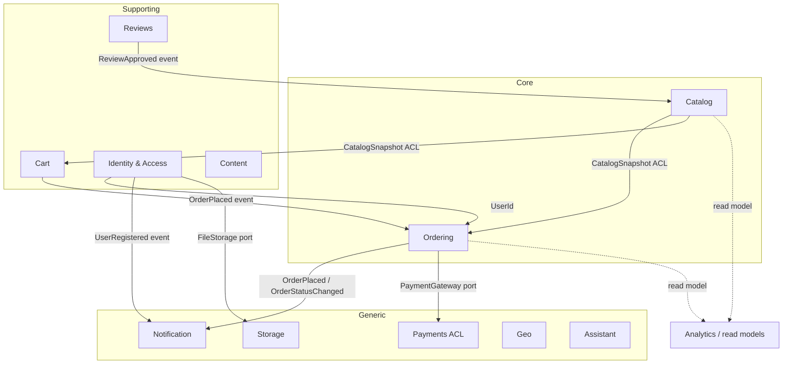

# Gearly Backend — Domain-Driven Design Refactoring Plan (Sprints 8–13)

> **Format:** Solo-developer sprints, continuing the numbering and cadence of [`REFACTORING_SPRINT_PLAN.md`](./REFACTORING_SPRINT_PLAN.md) (S1–S7, complete). One-week cadence (≈4 focused dev-days/sprint). Each sprint ends on a **green build**, so any sprint is a safe stopping point. One sprint branch at a time (`ddd/sN-<theme>`); commit per checklist item so regressions are bisectable.

---

## Why this refactor

Sprints S1–S7 cleaned the backend **tactically**: secrets externalized, global error handling, god-services split, a `mapper/` layer, the Bookify→Gearly rename, a 51-test safety net, DTO-only responses. What they did not change is the **architecture**.

A survey of all 190 Java files confirms the backend is still a textbook **anemic layered application**:

| Symptom | Evidence |
|---|---|
| **Maximally anemic model** | 19 `@Document` classes; **exactly one behavior method** in the whole `model/` package (`TimeFrame.getStartInstant`, `model/TimeFrame.java:14`). Every entity is a Lombok `@Getter @Setter` data bag with a fully public setter surface. |
| **Invariants live in services** | The order state machine is a static map on `AdminOrderService` (`service/admin/AdminOrderService.java:36-51`) — and is **bypassable through three other write paths**: `patchOrder:83`, `OrderMapper.applyUpsert:38`, `updateOrderStatusFromMomo:232`. |
| **Zero value objects** | Money is `double` on every persisted field but `BigDecimal` in the calculation layer, round-tripped lossily at `CustomerOrderService.java:150`. Rating is an unbounded `int` (a rating of `900` is accepted). IDs are `String` except `Review`'s `ObjectId`. Timestamps are `Instant` / `Date` / `LocalDateTime` / **`String`** depending on the class. |
| **Duplicated rules** | The stock check exists in **five** places. `CustomerOrderService.cancelOrder` contradicts `AdminOrderService`'s transition table (`PENDING→PENDING_REFUND` vs `DELIVERED→PENDING_REFUND`). |
| **No consistency guarantees** | All **7 `@Transactional` annotations are inert** — there is no `MongoTransactionManager` bean and Mongo runs standalone. `createOrder` can leave an order placed with stock only partially decremented. No `@Version` anywhere, so two concurrent checkouts can both pass the stock check and oversell. |
| **No domain events** | Zero `ApplicationEventPublisher` / `@EventListener` usage. Email sends, stock decrements, and cart clears are hard synchronous calls inside nominal transaction scopes. |

**Goal:** restructure the backend into **bounded contexts with rich aggregates that cannot be put into an illegal state**, and make that structure *strict* — enforced by **ArchUnit fitness functions**, not by convention.

### Two hard constraints shaping every decision

1. **`mapper/ResponseDtoWireCompatTest.java` pins the JSON wire format byte-for-byte** to the current document shape. Both frontends depend on it.
2. **There is no migration framework** (no Flyway/Liquibase/Mongock). Schema changes mean appending idempotent, type-guarded steps to `backend/data/seed/migrate.js`, following the pattern proven in S7.

### Confirmed direction (decisions taken)

| Decision | Choice | Consequence |
|---|---|---|
| **Domain ↔ persistence** | **Rich `@Document` aggregates + Mongo custom converters** | Aggregates keep `@Document` but gain private setters, behavior, and value objects. `MongoCustomConversions` writes `Money` as a plain `double` and `ProductId` as a `String`, so **the DB shape and the JSON wire shape stay byte-identical**. No third mapping layer, no migration for the VO introduction. |
| **Consistency** | **Single-node replica set + `MongoTransactionManager`** | Makes the existing `@Transactional` annotations real. Plus `@Version` optimistic locking on `Product`/`Order`/`Cart` to close the oversell race. |
| **Interfaces / ports** | **Repository ports + external-system ports only** | Honors S3's "no service interfaces" decision. Application and domain services stay plain `@Service` classes; only `OrderRepository`, `PaymentGateway`, `NotificationSender`, `FileStorage`, `ExchangeRateProvider` etc. become interfaces. |

---

## Target architecture

```
com.dominator.gearly
├── shared/domain            Money, Quantity, Rating, EmailAddress, PhoneNumber,
│                            PersonName, Slug, typed IDs, AggregateRoot, DomainEvent
├── shared/infrastructure    MongoCustomConversions, Jackson module
│
├── ordering/    {domain, application, infrastructure, api}   ← CORE
├── catalog/     {domain, application, infrastructure, api}   ← CORE
├── cart/        {domain, application, infrastructure, api}
├── reviews/     {domain, application, infrastructure, api}
├── identity/    {domain, application, infrastructure, api}
│
├── payments/     {domain (ports), infrastructure (MoMo, FX)}  ← ACL
├── notification/ {domain (port), infrastructure (SMTP)}
├── storage/      {domain (port), infrastructure (local disk)}
├── geo/ content/ assistant/
│
├── analytics/               the ONLY package allowed to use MongoTemplate (query side)
└── platform/                config, security, exception (cross-cutting)
```

### Context map



**Relationship styles:** Catalog→Ordering and Catalog→Cart are **customer/supplier with an anti-corruption layer** (`CatalogSnapshot`) — the downstream contexts copy price/title at capture time and never hold a `Product`. Reviews→Catalog is **event-driven**. Payments/Notification/Storage/FX are **generic subdomains behind ports**.

### Layer rules — enforced by ArchUnit, tightened each sprint

- `..domain..` may import only: JDK, Lombok `@Getter`, `org.springframework.data.annotation.*`, `org.springframework.data.mongodb.core.mapping.*`.
  **Banned in `..domain..`:** `org.springframework.web..`, `org.springframework.security..`, `org.springframework.http..`, `org.springframework.data.mongodb.repository..`.
- `..api..` must not depend on `..infrastructure..`.
- No cross-context dependency except via `shared..`, a published domain event, or a named port.
- No `@Document` class outside `..domain..`.
- No public setter on an aggregate root.
- `MongoTemplate` may only be referenced from `analytics..`.

---

## Sprint map at a glance

| Sprint | Theme | Est. | Risk | Ships |
|---|---|---|---|---|
| **S8** | Strategic design & guardrails | ~4 d | Med | Context map, ArchUnit, real transactions, `@Version`, characterization tests |
| **S9** | Shared kernel (VOs, typed IDs, converters) | ~4 d | Med | `Money`/`Rating`/`Quantity`/typed IDs — DB + wire shape unchanged |
| **S10** | Ordering context (core domain) | ~4.5 d | **High** | Rich `Order`, state machine on the aggregate, `PricingPolicy`, domain events |
| **S11** | Catalog & Cart contexts | ~4 d | Med | One stock rule, `Cart` behavior, catalog ACL, price-tamper fix |
| **S12** | Reviews & Identity/Access | ~4 d | Med | Review lifecycle, `User` aggregate, security out of the domain, 4 security fixes |
| **S13** | Supporting contexts & closeout | ~4 d | Low–Med | Payment/FX/email/storage ports, analytics as query side, ArchUnit repo-wide |

**All six sprints are shipped.** Each has an outcome section below recording what actually
landed, what running it caught that the plan did not anticipate, and where the result
deviates from what is written here. **51 tests at the start of S1; 541 at the end of S13.**

**Dependency order is strict: S8 → S9 → S10 → S11 → S12 → S13.**
S8 must land first — S10–S12 rewrite three services that have **zero test coverage today**, and the characterization suite is the only thing that makes that safe.

---

## Cross-cutting working agreements

Inherits everything from `REFACTORING_SPRINT_PLAN.md` §"Cross-cutting working agreements", plus:

- **One aggregate per transaction.** Anything crossing aggregates goes through a domain event.
- **Reference other aggregates by typed ID only**, never by object reference.
- **Snapshot semantics are deliberate.** `OrderLine` and `CartLine` copy price/title at capture time (already the behavior — documented at `mapper/OrderMapper.java:10-13`). Formalize as `CatalogSnapshot`.
- **The S8 characterization suite is the contract.** Every later sprint must leave it green. A deliberate behavior change means editing that test **in the same commit**, with the rationale in the commit message.
- **`ResponseDtoWireCompatTest` must stay green throughout.** Any intentional break is its own checklist item with a companion frontend task.
- **Definition of Done (per sprint):** the S1–S7 DoD *plus* ArchUnit green *plus* the characterization suite green.
- **Branch:** `ddd/s8-foundations`, `ddd/s9-shared-kernel`, … Self-review diff pass before merging.

---

## Sprint 8 — Strategic design & guardrails
**Goal:** Agree the context map, stand up the package skeleton and fitness functions, make transactions real, and get a safety net under the three fat untested services **before** touching them.

**Backlog**
- [x] **Characterization tests first — the highest-value item in the whole program.** `CustomerOrderService` (240 L), `CartService` (236 L), and `ReviewService` (163 L) are the primary extraction targets and have **zero coverage today**. Write `CustomerOrderServiceTest` (8% tax, the >$30 free-shipping threshold, cancel-paid vs cancel-unpaid, MoMo status update), `CartServiceTest` (add / update / merge / stock-clamp / `syncCartWithStock`), `ReviewServiceTest` (`applyRating` rollup). **Lock current behavior exactly, bugs included.**
- [x] **Context map + package skeleton:** create the context packages with a `package-info.java` each, stating the context's responsibility and its relationships. No code moves yet.
- [x] **ArchUnit:** add `com.tngtech.archunit:archunit-junit5` (test scope) + `ArchitectureFitnessTest`. Rules scoped to the new packages only, so the test is green on day one and tightens each sprint.
- [x] **Make `@Transactional` real:** `--replSet rs0` + a one-shot `rs.initiate()` in `docker-compose.yml`; a `MongoTransactionManager` bean in `platform/config`. Testcontainers' `MongoDBContainer` already starts a single-node replica set, so integration tests get real transactions for free.
- [x] **Fix the self-invocation bug:** `CustomerOrderService.java:189` — `createOrderAndGetMomoUrl` calls `createOrder` through `this`, bypassing the proxy, so the inner `@Transactional` never applies.
- [x] **Optimistic locking:** `@Version` on `Product`, `Order`, `Cart` — closes the read-then-write oversell race at `ProductService.java:52-59`. Map `OptimisticLockingFailureException` → **409** in `GlobalExceptionHandler`.
- [x] **Docs:** update `backend/README.md` + `backend/Makefile` for the replica-set requirement.

**Verify:** `mvn test` green with the new characterization tests; `rs.status().ok` returns 1; an integration test that injects a mid-flow exception into `createOrder` proves **both** the order *and* the stock decrement roll back.

**Risks:** the replica-set change breaks a plain `mongo` local setup until `rs.initiate()` runs — the Makefile and README must cover it. Existing data files work unchanged.

### S8 outcome — shipped

Branch `ddd/s8-foundations`, seven commits. **147 tests green** (51 before the sprint).

| Item | Landed as |
|---|---|
| Characterization suites | 78 tests across the three services; 12 current bugs pinned and labelled `KNOWN BUG` with the sprint expected to change each |
| Context map | 60 `package-info.java` files; no production class moved |
| ArchUnit | `ArchitectureFitnessTest`, 10 rules; each verified by planting a deliberate violation and confirming it fails |
| Real transactions | `platform/config/TransactionConfig`; `--replSet rs0` with the healthcheck as an idempotent `rs.initiate()`; `directConnection=true` |
| Self-invocation | placement routed through an `ObjectProvider` self-reference; the MoMo call moved outside the transaction |
| Optimistic locking | `@Version` (`@JsonIgnore`d) on the three aggregates, 409 mapping, `migrate.js` backfill + updated seed dumps |

**Verification actually performed**, not just asserted:

- `rs.status().ok` → `1`, one `PRIMARY` member.
- `OrderPlacementTransactionIntegrationTest` proves the rollback against a real replica
  set — and the assertion was shown to be **non-vacuous** by removing the
  `MongoTransactionManager` bean and confirming it fails with the order still present.
- A positive control commits both the order and the stock decrement, so the rollback
  test cannot pass for the wrong reason.
- `ResponseDtoWireCompatTest` is green **unchanged** — `@JsonIgnore` on `version` keeps
  the entity's JSON identical, so neither frontend sees a wire change.

**Deviations from the plan as written, and why:**

1. **`createOrderAndGetMomoUrl` also lost its own `@Transactional`.** The plan scoped
   this item to "make the inner `@Transactional` apply". Simply fixing the proxy call
   would have left an external HTTP request to MoMo running inside an open database
   transaction. The transaction now belongs to `createOrder` alone — one aggregate, one
   transaction — which is the state S10 completes by moving the gateway call to an
   `AFTER_COMMIT` listener.
2. **`@Version` needed a data migration the plan did not anticipate.** Spring Data treats
   a `null` version as "not yet persisted", so a pre-S8 document would have its first
   `save()` issued as an *insert* and die on the duplicate `_id`. `migrate.js` step 6
   backfills `version: 0` and the seed dumps carry it. Covered by a test.
3. **The concurrent-checkout proof landed early.** The plan lists it under S11's verify
   step, but S8 is where `@Version` is introduced, so the deterministic two-reader race
   test ships here.

**Carried into later sprints (not S8 gaps):** the ArchUnit `SCOPE:` markers come off in
S13; the `ObjectProvider` self-reference seam disappears in S10.

---

## Sprint 9 — Shared kernel: value objects, typed IDs, converters
**Goal:** Introduce the type vocabulary the aggregates will be written in, **without changing a single byte in Mongo or on the wire.**

**Backlog**
- [x] **`shared/domain` value objects:** `Money` (BigDecimal + Currency, scale 2 HALF_UP, `plus`/`minus`/`times`/`isGreaterThan`) replacing `double` on `Order.totalAmount:27`, `OrderItem.price`, `CartItem.price`, `Product.price`/`originalPrice`, `Transaction.amount`. Plus `Quantity` (non-negative), **`Rating` (1–5, validated)** — today `CreateReviewRequestDTO` has no bounds and `applyRating` will happily fold in a rating of `900`. Plus `ProductRating` (count/total/average as one invariant), `EmailAddress`, `PhoneNumber`, `PersonName`, `Slug`.
- [x] **Kill the `fullName` split:** `PersonName` derives `fullName`, resolving the two sources of truth between `UserService.java:35` (computes it) and `AuthService.java:85` (takes it from the client).
- [x] **Typed IDs:** `ProductId`, `OrderId`, `UserId`, `CartId`, `ReviewId`, `CategoryId` as records over `String`. `CategoryId` absorbs the `ObjectId`↔`String` asymmetry currently patched in `ProductMapper.java:117`; `Review`'s three `ObjectId` fields normalize here.
- [x] **Enums:** `Role` (replaces the stringly-typed `User.role`, consumed at `AuthenticatedUser.java:22`), `ProductCondition` (replaces the free-text `condition` matched by string equality at `ProductRepositoryCustomImpl.java:31`).
- [x] **`shared/infrastructure/DomainTypeConverters`** — a `MongoCustomConversions` bean with read/write converter pairs: `Money↔Double`, `Quantity↔Integer`, `Rating↔Integer`, `ProductId↔String`, `CategoryId↔ObjectId`, `EmailAddress↔String`. **This is the load-bearing piece — document shape is unchanged.**
- [x] **Jackson module** with matching `@JsonValue`/`@JsonCreator` so DTO serialization is unchanged. Extend `ResponseDtoWireCompatTest` to cover the VO-carrying DTOs.
- [x] **Timestamp normalization** (mirroring the proven S7 `Product` pattern): `Category.addedAt/modifiedAt` and `Review.addedAt/modifiedAt` `String`→`Instant`; `Cart` `Date`→`Instant`; `VerificationToken` `LocalDateTime`→`Instant`. Add idempotent, type-guarded `$toDate` steps to `data/seed/migrate.js` and update the seed dumps. Note `ReviewService.java:61` currently sorts reviews by a *String* date.
- [x] **Tests:** VO unit tests (rating 0 and 6, malformed email, negative quantity all rejected); a `@DataMongoTest` round-trip asserting the **stored BSON types** are unchanged.

**Verify:** dump a document with `mongosh` before and after and diff — identical. Wire-compat test green. `grep -rn "double price\|double totalAmount" backend/src/main` returns nothing.

**Risks:** a missed converter surfaces as a mapping exception at boot — caught by `GearlyApplicationTests.contextLoads`. The timestamp normalization touches live data; migrate.js steps must be idempotent and type-guarded like S7's.

### S9 outcome — shipped

Branch `ddd/s9-shared-kernel`, five commits. **267 tests green** (240 after the kernel
landed, 147 before the sprint).

| Item | Landed as |
|---|---|
| Value objects | `Money`, `Quantity`, `Rating`, `ProductRating`, `EmailAddress`, `PhoneNumber`, `PersonName`, `Slug` — 93 unit tests |
| Typed IDs | `ProductId`, `OrderId`, `UserId`, `CartId`, `ReviewId`, `CategoryId` over a shared `DomainId` |
| Enums | `Role`, `ProductCondition` |
| Converters | `DomainTypeConverters` (14 pairs) + `ObjectIdBackedIdConverters` for the per-property cases |
| Jackson | `@JsonValue`/`@JsonCreator` on the kernel types — no separate module needed, see below |
| Timestamps | `Category`/`Review` `String`→`Instant`, `Cart` `Date`→`Instant`, `VerificationToken` `LocalDateTime`→`Instant`; `migrate.js` step 7 + regenerated dumps |
| `fullName` split | `User.setName(PersonName)` writes all three fields; `AuthService` stops trusting the client's `fullName` |

**Verification actually performed**, not just asserted:

- `DomainTypeBsonRoundTripTest` reads the **raw `org.bson.Document`**, bypassing the entity
  mapping, and asserts the concrete stored class of each field. A save-then-load test
  could not do this: it would pass just as happily with `Money` stored as a nested
  document, because it would read back the same way.
- Shown **non-vacuous** the way S8 proved its rollback test — removing
  `MoneyToDoubleConverter` from the registration makes 5 of them fail with the value
  stored as `{amount, currency}`. Restored, all green.
- The wire format is pinned by **literal JSON assertions**, not by the DTO-equals-entity
  tests. Those compare the two representations to *each other*, so they stayed green
  through the whole `double`→`Money` change and would have stayed green even if `Money`
  had serialized as an object. `price` is still `1599.0`, a `DoubleNode` — a `BigDecimal`
  `@JsonValue` would have written `1599.00`.
- The migration was run against a **real `mongo:6.0` with the actual seed dumps**: 10
  categories and 91 reviews converted, zero warnings, second run a no-op, no date outside
  2020–2030 (which would betray a month/day transposition), dumps re-exported and
  re-imported clean.
- `grep -rn "double price\|double totalAmount" backend/src/main` returns nothing.

**What running it for real caught that the plan did not anticipate:**

`reviews` holds a **third** timestamp format — `"6/9/25, 3:42 AM"`, an en-US
`toLocaleString()` value, in 40 of 91 documents. It matters twice over:

1. Unlike the two ISO shapes, it does **not** coerce into an `Instant` on read. Without
   the migration, 44% of the reviews collection becomes unreadable the moment the field
   type changes. Both facts are pinned as tests.
2. It forced the implementation. The first version of step 7 was an aggregation pipeline
   and **aborted mid-collection** on the first such document: `$dateFromString` has no
   specifier for a 12-hour clock or an AM/PM marker (no `%I`, no `%p`). Step 7 is now a
   client-side pass that assembles values with `Date.UTC`, which also makes the result
   independent of the operator's timezone — for a zone-less string, `new Date(str)` would
   silently shift it by the local offset.

**Deviations from the plan as written, and why:**

1. **No separate Jackson module.** The plan asked for one "with matching
   `@JsonValue`/`@JsonCreator`". Every type needing it is ours, so the annotations live on
   the kernel types directly. A module would have been a second place to keep in sync with
   no behavior it could add.
2. **`Rating` and `ProductRating` ship without adopting a field.** `Review.rating` stays an
   `int` until S12: a legacy document holding the out-of-range rating the S8 suite pins as
   a `KNOWN BUG` must not become unreadable in the meantime. Folding `Product`'s three
   rating fields into one VO would change the stored shape, which S9 forbids — S11 does it.
3. **`EmailAddress` validates but does not normalize case.** `User.email` carries a unique
   index and is the login identifier, so lower-casing stored addresses is a migration with
   a duplicate-key failure mode, not a type change. Deferred to S12.
4. **`Role` and `ProductCondition` live in `shared/domain`,** not in `identity/` and
   `catalog/`. `DomainTypeConverters` needs both, and ArchUnit's
   `shared_kernel_depends_on_no_context` forbids the shared kernel importing a context.
5. **`ObjectIdBackedIdConverters` was not in the plan.** `ProductId` is stored as a
   `String` on an order line but as an `ObjectId` in `reviews.productId` — one Java type,
   two BSON forms. `MongoCustomConversions` registers per *type* and cannot express that;
   `@ValueConverter` applies per *property* and can.

**Two deliberate changes, both evidenced:**

- **`Product.categoryIds` on the wire.** A raw `ObjectId` serialized as
  `{"timestamp":…,"date":…}` — an unusable shape. It is now the hex string. Verified by
  grep across both frontends that neither reads `categoryIds`: they consume
  `categoryNames` and send category ids back as the `genres` query parameter, already
  as hex.
- **An unrecognized `condition` filter is now a 400** rather than a string-equality match
  that could only ever return nothing. The storefront only sends values from its own fixed
  list.

Review timestamps gain a `Z` suffix, which is a **fix**: `ProductReviews.jsx` parses them
with `new Date(addedAt)`, and a zone-less string is read as local time, so the displayed
date was shifted by the viewer's UTC offset.

**Carried into later sprints (not S9 gaps):** `Quantity`, `EmailAddress`, `PhoneNumber`
and `Slug` ship as vocabulary with converters and tests but no adopted field yet — the
aggregates that use them are built in S10–S12. `ProductSearchDTO.minPrice/maxPrice` stay
`double`, being range bounds on a query string rather than persisted money.

---

## Sprint 10 — Ordering context (core domain) ⚠️ highest logic churn
**Goal:** `Order` becomes a real aggregate root that **cannot be put into an illegal state.** Highest-value sprint of the program.

**Backlog**
- [x] **Move + de-anemize:** `Order`, `OrderItem`→`OrderLine`, `Payment`, `Transaction`→`PaymentTransaction`, `ShippingInformation` into `ordering/domain`. **Drop the stray `@Document`** on the embedded types (they are never standalone collections — a copy-paste artifact). Remove `@Setter`/`@AllArgsConstructor`; private no-arg constructor for Spring Data.
- [x] **`OrderStatus` owns the transition table:** move `ALLOWED_SOURCES` (`AdminOrderService.java:36-44`) onto the enum as `canTransitionTo(target)` / `assertCanTransitionTo(target)`; `TX_EFFECTS` moves onto `Order`.
- [x] **Behavior onto the aggregate:** `Order.place(UserId, List<OrderLine>, ShippingInformation, PaymentMethod, PricingPolicy)`, `cancel(reason)`, `transitionTo(status)`, `recordPayment(tx)`, `markReviewed()`, `isOwnedBy(UserId)`. `Payment.isSettled()`, `Payment.initiateRefund(Money)` — replacing the feature-envy `CustomerOrderService.initiateRefund(order, payment)` at `:125-134`.
- [x] **`PricingPolicy` domain service:** the four constants at `CustomerOrderService.java:41-44` become `@ConfigurationProperties("gearly.pricing")` bound into it. **Behavior preserved exactly:** 8% tax; subtotal > $30 → free shipping, else $15.
- [x] **Close all three bypass paths:** `patchOrder:83` and `OrderMapper.applyUpsert:38` route status changes through `order.transitionTo(...)`; `updateOrderStatusFromMomo:232` uses `recordPayment` + `transitionTo`. Also **reconcile the contradiction** — `ALLOWED_SOURCES` says `PENDING_REFUND` comes only from `DELIVERED`, but `cancelOrder:105-118` drives `PENDING`/`PROCESSING → PENDING_REFUND`. The cancel path is the real rule: widen the table and encode it **once**. *Deliberate behavior change — update the S8 characterization test in the same commit.*
- [x] **Also fix `patchOrder`:** it silently recomputes the order total from whatever items the client sent (`AdminOrderService.java:92-98`), with no relation to catalog prices. Route through the aggregate.
- [x] **Keep the API stable:** `transition` now throws instead of returning `boolean`, but the application service catches and preserves the existing `ResponseEntity<Boolean>` contract on the seven `/api/admin/orders/{id}/set-*` endpoints — **no frontend change required.**
- [x] **Ports:** `OrderRepository` interface in `ordering/domain`; `MongoOrderRepository` adapter in `ordering/infrastructure` wrapping Spring Data. `OrderRepositoryCustomImpl`'s criteria-building moves into the adapter.
- [x] **Application layer:** `PlaceOrderService`, `CancelOrderService`, `OrderQueryService`, `AdminOrderService` — take command records and a `UserId`, **never** `AuthenticatedUser` (controllers unwrap; `CartController.java:25` already does this correctly).
- [x] **Domain events:** an `AggregateRoot` base collects them. `OrderPlaced`, `OrderCancelled`, `OrderStatusChanged`, `PaymentRecorded`. `OrderPlaced` → `@TransactionalEventListener(BEFORE_COMMIT)` performs the stock decrement + cart clear **inside** the now-real transaction. The MoMo URL call moves to `AFTER_COMMIT`, so an external HTTP call is never inside a transaction (currently `CustomerOrderService.java:191`).
- [x] **Relocate `service/common/PaymentFactory`** into `ordering/domain` — it is already a domain factory, just misfiled.
- [x] **Tighten ArchUnit** onto `ordering..`.

**Verify:** the S8 characterization tests are green — that is the proof. `grep -rn "setOrderStatus" backend/src/main` returns zero hits outside `Order`. An illegal transition returns **409 from every path**, including `PATCH`.

**Risks:** **highest churn in the program** — entirely dependent on S8's safety net existing first. Split into compile-green steps: *move → encapsulate → extract policy → events*, compiling between each.

### S10 outcome — shipped

Branch `ddd/s10-ordering`, eight commits. **334 tests green** (267 before the sprint).

| Item | Landed as |
|---|---|
| Move + de-anemize | `Order`, `OrderLine`, `Payment`, `PaymentTransaction`, `ShippingInformation` in `ordering/domain`; no public setters, four stray `@Document`s dropped |
| Transition table | `OrderStatus.canTransitionTo` / `assertCanTransitionTo`, 23 tests; `TX_EFFECTS` onto `Order` |
| Behavior | `place`, `cancel`, `transitionTo`, `recordGatewayResult`, `recordPayment`, `markReviewed`, `isOwnedBy`, `isPaid`, `replaceContent`, `amend`; `Payment.isSettled` / `initiateRefund` |
| PricingPolicy | domain service bound from `gearly.pricing.*` by `OrderingConfiguration` |
| Bypass paths | all three closed — `grep -rn setOrderStatus src/main` finds only the response DTO's own setter |
| Ports | `OrderRepository` + `OrderQuery` + `OrderPage` in the domain; `MongoOrderRepository` adapter, 13 new integration tests |
| Application + api | `PlaceOrderService`, `CancelOrderService`, `OrderQueryService`, `AdminOrderService`, `OnlinePaymentService`, all taking a `UserId` and a command record |
| Domain events | `AggregateRoot` / `DomainEvent` in the kernel; `OrderPlaced` → `BEFORE_COMMIT` listener |
| ArchUnit | `allowEmptyShould` removed from all ten rules, two new ones added, 12 total |

**Verification actually performed**, not just asserted:

- **The `BEFORE_COMMIT` phase was falsified.** Switching `OrderPlacedListener` to
  `AFTER_COMMIT` makes the S8 rollback test fail against a real replica set — the order
  survives a failed placement. The phase is load-bearing, not decoration. Restored, all
  green. The positive control covers the other direction, so the rollback test cannot
  pass by the listener simply never running.
- **Both new ArchUnit rules were falsified** the way S8 falsified its ten: an
  `AuthenticatedUser` field on `OrderQueryService` fails
  `security_types_stop_at_the_api_layer`; a `MongoRepository` field on
  `AdminOrderService` fails `spring_data_repositories_live_only_in_infrastructure`.
- **The 409 is asserted through the real HTTP stack**, not through a service call:
  `AdminOrderStatusEndpointTest` drives `PATCH {"orderStatus":"REFUNDED"}` through the
  real security chain and the real `GlobalExceptionHandler` and gets a 409, and drives a
  refused `set-ship` and gets `200 false`. Both halves in one place, because they pull in
  opposite directions.
- `GearlyApplicationTests.contextLoads` runs against a real Mongo, so the whole rewired
  bean graph — five new application services, the adapter, the event listener, the
  `@ConfigurationProperties` binding — is proven to start.
- The stored BSON is still what it was: `DomainTypeBsonRoundTripTest` reads the **raw
  `org.bson.Document`** and asserts `userId` is a `String`, `items[].productId` a
  `String`, `items[].quantity` an `Integer` and `orderStatus` a `String` after adopting
  `UserId`, `ProductId` and `Quantity` on the aggregate.

**What running it for real caught that the plan did not anticipate:**

Giving the aggregate behavior **silently added three fields to every order response.**
Jackson reads `isX()` as a property, so `Order.isPaid()`, `Payment.isSettled()` and
`PaymentTransaction.isSuccessful()` became `paid`, `settled` and `successful` on the wire.
`ResponseDtoWireCompatTest` caught `paid` — but *not* the other two, because an order's
`payment` is the same domain object on both sides of the DTO-equals-entity comparison, so
a field added to a nested type appears in both trees and they stay equal. That is the S9
lesson in a new place. All three are `@JsonIgnore`d, and a new test now pins the literal
JSON key set of an order, its payment, its transactions, its lines and its shipping.

**Deviations from the plan as written, and why:**

1. **`PENDING → PROCESSING` gained a reverse edge.** The plan said the MoMo callback should
   use `transitionTo`, and the S8 suite pins a failed callback forcing an order back to
   `PENDING`. Those two are only compatible if the payment reversal is a declared edge of
   the table, so it is one. The alternative — a special case inside the aggregate for the
   gateway — is a bypass with better manners.
2. **`initiateRefund` takes the raw-response text as a second argument.** The plan's
   signature is `initiateRefund(Money)`, but every refund row in the collection carries the
   `"Refund initiated for order: …"` note and dropping it would lose the order reference.
3. **`PaymentMethod` stayed a `String`.** The stored values are inconsistent — `"cod"` from
   the customer path, `"MOMO"` in fixtures — so an enum needs a case-folding converter and
   would make any unrecognized legacy value unreadable. S13 introduces it with the
   `PaymentGateway` port, where the supported set is actually decided.
4. **The MoMo call is not on an `AFTER_COMMIT` listener.** It could not be: the endpoint
   returns the gateway URL synchronously, and a listener has nowhere to return it to. The
   plan's actual goal — no external HTTP call inside a transaction — is met by
   `OnlinePaymentService` being a separate, non-transactional bean that calls the
   transactional `PlaceOrderService`. That is also what **removes the `ObjectProvider`
   self-reference** S8 introduced and flagged for this sprint.
5. **`OrderPlaced` carries no order id.** Identity is assigned by MongoDB on insert, and
   nothing that reacts to placement needs one — the stock decrement and cart clear key off
   the lines and the buyer. Adding it means moving identity assignment into the domain,
   which is worth doing deliberately rather than as a side effect of introducing events.
6. **`Address` moved to `shared/domain`** (and lost its own stray `@Document`).
   `ShippingInformation` could not enter `ordering.domain` while it referenced
   `model.Address` — `domain_does_not_reach_back_into_legacy_packages` says so. It stays a
   mutable Lombok bag until S12, which owns the Identity path that would have to change.
7. **`TransactionRepository` was deleted**, an S13 item pulled forward by necessity: it was
   injected nowhere and typed on what is now an embedded-only class.
8. **The `MongoTemplate` ArchUnit rule was narrowed to permit `..infrastructure..`.** It
   permitted `analytics` alone, which was too strict to be right rather than usefully
   strict: a repository adapter is by definition the layer that knows the storage
   technology, and the customer order search — a dozen optional regex clauses OR'd together
   — cannot be expressed any other way. Under the old wording the only way to pass was to
   leave the criteria in the legacy `repository/` package, i.e. to pass by not finishing the
   move. **S13's verify step should be read as `grep -rn "MongoTemplate" backend/src/main |
   grep -vE 'analytics|infrastructure'`.**

**Deliberate behavior changes, each with its test edited in the same commit:**

- **`PENDING_REFUND` reconciled** — widened to `{PENDING, PROCESSING, DELIVERED}`, as
  planned. The cancel path was the real rule; narrowing instead would have stranded paid
  cancellations with no way to record the refund.
- **The total is derived, never assigned.** `PUT` used to take the client's `totalAmount`
  and the client's `items` independently, so a payload could store lines worth $10 against
  a total of $10,000. `PATCH` recomputed the bare line sum, silently dropping the tax and
  shipping the order was placed with. Both re-derive through `PricingPolicy` now.
- **The S8 `KNOWN BUG` about the immutable transaction list is fixed.** A freshly placed
  order accepts further transactions in memory; the list it hands out is still unmodifiable,
  now deliberately, so appending goes through the aggregate.
- **An unrecognized `?status=` is a 400.** It used to be a 500 or an empty list depending on
  whether a search term accompanied it, because the two query paths read the parameter
  differently.
- **`cancelOrder` throws `OrderCannotBeCancelledException`, not `ConflictException`.** Same
  409 — the domain may not name `org.springframework.http`, so the aggregate states the rule
  and `GlobalExceptionHandler` picks the code. `GlobalExceptionHandlerTest` pins that.

**🔴 Companion frontend task — the one user-visible consequence.**
`frontend_admin/gearly/src/pages/orders/create.tsx` computes `totalAmount` as the bare sum
of the lines, shows it in a read-only field, and posts it. The server now ignores that value
and derives the total, so an admin-created order will store **subtotal + 8% tax + shipping**
where the form displayed just the subtotal. The stored number is the correct one — it is what
a customer-placed order costs — but the form's label is now wrong. Fix is display-only:
relabel the field "Subtotal", or drop it and show the server's total after creation. Nothing
breaks in the meantime; the number shown before saving simply understates what is charged.
The `set-*` buttons are unaffected — verified in
`components/order/actions/index.tsx`, which reads the boolean this sprint deliberately kept.

**Carried into later sprints (not S10 gaps):** the unguarded `getImages().getFirst()` in the
catalog snapshot and the five duplicated stock checks are S11's, along with the
`CatalogSnapshot` ACL that replaces `PlaceOrderService.snapshotFromCatalog` entirely; the
missing ownership check on `getOrderById` is S12's IDOR item and is flagged in the code that
has it; nothing restocks a cancelled order's units, which needs S11's
`Product.restock(Quantity)` and an `OrderCancelled` listener.

---

## Sprint 11 — Catalog & Cart contexts
**Goal:** One stock rule, one cart rule, and an anti-corruption layer between Catalog and the contexts that snapshot from it.

**Backlog**
- [x] **`Product` root:** `reserve(Quantity)` / `restock(Quantity)` throwing `InsufficientStockException`; `addRating(Rating)` on a `ProductRating` VO; `changePrice(Money)`. This collapses **five duplicated stock checks** — `ProductService.java:52-59`, `CustomerOrderService.java:164`, and `CartService` at `:86-93`, `:106-113`, `:210-217` — into one rule on the aggregate.
- [x] **Stop returning `null`:** `ProductService.getProductById:43` returns `null` on a miss, so `getStock` and `decreaseStock` NPE. Throw `ResourceNotFoundException`.
- [x] **`Category`** into `catalog/domain`. The `@Transient categoryNames` read-model leak on `Product` moves to an application-layer projection. `ProductsInStockRepository`'s hard-coded `$lt: 10` **business rule in an annotation** becomes a `LowStockThreshold` config value.
- [x] **`Cart` root:** `addLine`, `changeQuantity`, `removeLine`, `merge(Cart)`, `reconcileWith(List<CatalogSnapshot>)` — absorbing `syncCartWithStock` (`CartService.java:32-58`), `mergeCart` (`:169-191`), and the triplicated clamp. `CartItem`→`CartLine`. Enforce the `userId` XOR `guestId` rule that is currently unenforced.
- [x] **ACL:** `CatalogSnapshot` + `ProductSnapshotPort`. Cart and Ordering never touch `Product` directly. `OrderMapper.toOrderItem` becomes `OrderLine.fromSnapshot(...)` — which also fixes its unguarded `getImages().getFirst()` (`OrderMapper.java:21`), a crash on any image-less product that `CartMapper.java:39-41` already guards against.
- [x] **🔒 Security — price tampering.** `CartController.java:30`, `CartController.java:59`, and `GuestCartController.java:35` bind `@RequestBody CartItem` — a **persistence document** whose `price`, `title`, `stock`, and `condition` are client-controlled and persisted without re-reading the catalog. Replace with `AddCartItemRequestDTO { productId, quantity }` and hydrate from the catalog snapshot. *Frontend contract change: the body shrinks, extra fields are ignored — verify the storefront's add-to-cart call.*
- [x] **Wishlist:** stays inside `User.favorites` for now, **documented as a deliberate aggregate choice**; splitting it into its own aggregate is logged as a follow-up.
- [x] **Tighten ArchUnit** onto `catalog..` and `cart..`.

**Verify:** characterization + wire-compat tests green. A concurrent-checkout integration test proves `@Version` prevents overselling. Posting a tampered `price` in an add-to-cart body has no effect on what is stored.

**Risks:** Med — the cart request-DTO change is the one frontend-visible item in this sprint.

### S11 outcome — shipped

Branch `ddd/s11-catalog-cart`, four commits. **371 tests green** (334 before the sprint).

| Item | Landed as |
|---|---|
| `Product` root | `reserve` / `restock` / `assertCanSupply` / `changePrice` / `addRating` / `removeRating` / `snapshot` in `catalog/domain`; no public setters, two more stray `@Document`s dropped (`Image`, `CartItem`) |
| One stock rule | `InsufficientStockException.requireAtLeast` — the only comparison of a wanted quantity against an available one left in the codebase; `Product` and `CatalogSnapshot` both call it |
| Stop returning `null` | `ProductNotFoundException` (a `DomainNotFoundException`) mapped centrally to 404 |
| `Category` | `catalog/domain`; `categoryNames` is `CategoryNameProjection`; `$lt: 10` is `LowStockThreshold` bound from `gearly.catalog.low-stock-threshold` |
| `Cart` root | `addLine`, `changeQuantity`, `removeLine`, `removeUnits`, `merge`, `reconcileWith`, `clear`; `CartLine`; userId XOR guestId enforced |
| ACL | `CatalogSnapshot` + `ProductSnapshotPort`; `OrderLine.fromSnapshot`; neither Cart nor Ordering names `Product` |
| Price tampering | `AddCartItemRequestDTO` / `MergeCartLineDTO` on the three endpoints; a line is constructible only from a snapshot |
| Ports | `ProductRepository`, `CategoryRepository`, `CartRepository` in the domain; three Mongo adapters |
| ArchUnit | two new rules, 14 total, both falsified |

**Verification actually performed**, not just asserted:

- **The price-tampering fix is proven through the HTTP stack**, not through a service
  call. `CartPriceTamperingIntegrationTest` posts the storefront's real eight-field
  body with `price: 0.01` against a real Mongo and asserts the catalog's $1,599 is
  what gets stored. Every layer between is part of the claim — Jackson has to *ignore*
  the extra fields rather than reject them, which is the whole basis of "no frontend
  change required", so that half is asserted too.
- **Both new ArchUnit rules were falsified before being trusted**, and one of them
  failed its falsification. `published_events_carry_only_shared_kernel_types` passed
  against a planted event carrying `List<OrderLine>`, because
  `JavaField.getRawType()` erases it to `java.util.List`. `getType()` sees the type
  argument — which is the entire case the rule exists for. The rule as first written
  would have been decoration.
- **The concurrency positive control failed on the first run**, and was worth more
  than the test it was controlling. Two placements were losing to a MongoDB
  `WriteConflict` from implicitly creating a collection the `@BeforeEach` had just
  dropped — nothing to do with stock. So "exactly one winner" had been passing for
  the wrong reason. With the collections pre-created, independent checkouts both
  commit and the oversell test means what it says.
- **The rating repair was run against a real `mongo:6.0` with the actual seed dump**:
  3 planted corrupt rollups repaired, 0 inconsistent left of 54, second run a no-op,
  all 51 seed products untouched.
- The stored BSON is still what it was: `DomainTypeBsonRoundTripTest` reads the raw
  `org.bson.Document` and asserts a cart line's `productId` is a `String` and its
  `quantity` and `stock` `Integer`s after adopting `ProductId` and `Quantity`, and
  that the cart's `userId` is still a bare string.

**What running it for real caught that the plan did not anticipate:**

**Two concurrent checkouts of the same product conflict even when stock covers both.**
Optimistic locking is conservative: both read the product document, both write it, and
the second loses on the version whether or not there was stock. Nothing retries, so the
loser gets a 409. That is the correct trade — refusing a sale is recoverable and
overselling is not — but it means a popular product under simultaneous load turns away
checkouts that had stock. Pinned as a test rather than left to be discovered; a retry on
`OptimisticLockingFailureException` belongs to whoever owns throughput.

**Deviations from the plan as written, and why:**

1. **`Product`'s rating stays three flat fields rather than folding into `ProductRating`.**
   S9 deferred the fold to this sprint; running it showed why it should not happen.
   `averageRating` is not only displayed, it is *queried* — the catalog sorts by it
   (the best-seller list and the `sortBy` switch) and filters on it (`minRating`). A
   `ProductRating` keeps the average **derived**, which is its entire point, so folding
   would either break three queries or force the derived value to be stored beside its
   own inputs. The invariant is enforced at the only place that can change the fields
   instead, and `Product.rating()` is the seam S12's `ReviewApproved` handler uses.
2. **`InsufficientStockException` builds its own message.** The plan said "collapse five
   duplicated stock checks"; five call sites each composing their own string is five
   rules again, and it showed — `CartService.addItems` produced the truncated
   `"Only 2 Left for "`, naming neither the product nor anything after the preposition.
   One phrasing, built from what the aggregate already knows.
3. **The ArchUnit published-language rule now recognizes a domain event by its
   `DomainEvent` interface, not by an `…Event` name suffix.** This is a loosening and
   worth saying so. The naming clause was never exercised while every listener lived in
   its event's own context; S11 exercised it, and a rule satisfied by a rename teaches
   people to rename things. The marker interface is the real signal, and everything the
   event *carries* is checked independently.
4. **`OrderPlaced` and `OrderCancelled` carry `Map<ProductId, Quantity>`.** Forced by
   item 3: `OrderLine` is ordering's internal type and the new listeners live in
   `catalog` and `cart`. It also fixed a live bug — the listener built that map with
   `Collectors.toMap`, which throws on a duplicate key, so an order carrying two lines
   for the same product (which the admin `PUT` path can create) failed placement with an
   opaque 500.
5. **`OrderPlacedListener` split in two.** One class holding a `ProductService` *and* a
   `CartService` made ordering the place that knew how to change two other contexts'
   state — a distributed monolith with events bolted on the front. `CatalogStockListener`
   and `CartOrderListener` each react for their own context.
6. **Cancelling an order restocks its units.** Not in the S11 backlog as such, but S10
   flagged it as "a real bug, deliberately not fixed" and named `Product.restock` and an
   `OrderCancelled` listener as what it needed. Both exist now.
7. **`CategoryController` and `AdminCategoryController` merged into one class with two
   mappings.** An S13 dead-code item pulled forward by necessity: they were byte-identical
   and both had to move, so keeping two meant writing the duplicate again. Both URLs
   unchanged.
8. **`DomainNotFoundException` (404) and `DomainRuleViolationException` (400) joined the
   shared kernel**, alongside S10's `DomainConflictException` (409). A domain package may
   not name `org.springframework.http`, and three contexts now need to say "missing" and
   "the request cannot be satisfied".
9. **A cart line's price is deliberately *not* refreshed on load**, only its stock hint.
   Snapshot semantics are the working agreement, and a price that rewrites itself under a
   customer is what they exist to prevent. This does leave a cart able to display a price
   the order will not charge, since placement re-reads the catalog — pre-existing, noted
   in `CartLine`, and a product decision rather than a refactor.

**Deliberate behavior changes, each with its test edited in the same commit:**

- **A review rating outside 1–5 is a 400**, where the S8 suite pinned 900 stars being
  folded into a product's average. Forced by `addRating(Rating)` — the value object makes
  it unrepresentable. S12 still owns the field-level validation message.
- **`updateQuantity(…, 0)` removes the line** instead of leaving a dead one behind.
- **An out-of-stock guest line is skipped on merge** instead of being folded in at
  quantity zero.
- **Every line's stock hint is refreshed on load**, not only the clamped ones. The
  storefront caps its quantity stepper with that number and was capping against a figure
  that could be months stale.
- **One database write per cart request.** The old code saved in `syncCartWithStock` and
  again in the operation that followed.
- **The over-stock message names the product** from every path.
- **An unrecognized `genres` value is a 400** rather than reaching `new ObjectId(...)`
  inside the repository and surfacing as a 500.
- **The cart's stock check no longer runs before the cart is loaded.** Same 400 either
  way; what differs is that a refused request now leaves behind a cart that has been
  reconciled with the catalog.

**No frontend task.** The one contract change — the add-to-cart and merge bodies
shrinking to `{productId, quantity}` — is backward compatible: Spring Boot ignores unknown
properties, so the storefront's existing eight-field payload keeps working untouched.
Verified by grep across both apps (`ProductCard.jsx`, `ProductDetails.jsx`,
`AuthContext.jsx` are the only callers) and asserted against the app's real `ObjectMapper`
rather than assumed.

**Carried into later sprints (not S11 gaps):** the review lifecycle and the rating rollup
moving to a `ReviewApproved` event are S12's, and `Product.removeRating` is already there
waiting for `ReviewRejected`; the IDOR on `getOrderById` and the unbound `guestId` on
`/api/guest-cart/**` are S12's and are both flagged in the code that has them; a retry on
optimistic-lock conflict, and the unbounded `User.favorites` array, are logged as scaling
follow-ups rather than modelling faults.

---

## Sprint 12 — Reviews & Identity/Access
**Goal:** Close the review-lifecycle holes, make `User` a real aggregate, and get Spring Security types out of the domain.

**Backlog**
- [x] **`Review` root:** bounded `Rating` VO; `submit`, `approve()`, `reject()` with a `ReviewStatus` transition rule. Today `AdminReviewService.java:47-52` allows `APPROVED → PENDING`.
- [x] **Fix the rating inconsistency.** `applyRating` (`ReviewService.java:155-162`) moves onto `Product.addRating(...)` and is driven by a **`ReviewApproved` domain event instead of firing at creation time.** Today `averageRating` counts reviews that were later *rejected*, while the public distribution query filters `status:'APPROVED'` (`ReviewRepository.java:23`) — the two numbers are structurally inconsistent. Add a `ReviewRejected` handler and a one-off recompute step in `migrate.js`. *Deliberate behavior change.*
- [x] **Guard double-review:** `createReview` never reads `order.isReviewed()` even though `:132` writes it, so a repeated call **re-inflates** `ratingCount`/`totalRating`. Also require a reviewable order status — a `CANCELLED` or `PENDING` order is currently reviewable.
- [x] **`identity/domain`:** `User` root with `Role`, `EmailAddress`, `PersonName`; `verify()`, `changePassword(...)`, `deactivate()`, `addFavorite`/`removeFavorite`. `VerificationToken`'s magic 30-minute TTL (`VerificationTokenService.java:34`) becomes config.
- [x] **Access boundary:** remove `AuthenticatedUser` (a Spring Security `UserDetails`) from all service signatures — controllers unwrap to `UserId`. Replace `throw new ApiException(HttpStatus.FORBIDDEN, …)` inside the domain (`CustomerOrderService.java:102`, `ReviewService.java:141`) with `AccessDeniedDomainException`, mapped in `GlobalExceptionHandler`. Ownership becomes `order.isOwnedBy(userId)`. Enable `@EnableMethodSecurity` and use `@PreAuthorize` for role checks alongside the URL rules.
- [x] **🔒 Four security bugs found during the survey — bundled here, each is small:**
  1. **IDOR:** `OrderController.java:59-62` `getOrderById` performs **no ownership check** — any authenticated user can read any order, including payment details and the buyer's shipping address.
  2. `SecurityConfig.java:53-56` permits `/api/reviews/**`, which also matches `POST /api/reviews/submit-review`; an anonymous POST NPEs into a **500 instead of a 401**.
  3. `JwtAuthenticationFilter.java:39` calls `extractEmail` *before* `validateToken:41`, so an expired or tampered token throws → **500 instead of 401**.
  4. `/api/guest-cart/**` is `permitAll` with a client-supplied `guestId` and no binding — **any guest cart is readable and mutable by anyone who knows the UUID.**
- [x] **Events:** `UserRegistered` — the email side effect moves out of `AuthService.register:94` into an `AFTER_COMMIT` listener, so a mail send is no longer inside a nominal transaction boundary.
- [x] **Tighten ArchUnit** onto `reviews..` and `identity..`.

**Verify:** fetching another user's order → 403; anonymous review POST → 401; expired token → 401; approve-then-reject leaves the product average correct; a rating of 0 or 6 → 400 with field errors.

**Risks:** Med. The rating recompute is a live-data change. Confirm no admin frontend call relied on the previously-open `getOrderById`.

### S12 outcome — shipped

Branch `ddd/s12-reviews-identity`, eight commits (seven of code, one of resume notes that was
deleted at the end). **435 tests green** (383 after identity landed, 267 at the end of S9).
The Docker-gated tests were run with Colima up, so the Testcontainers suites actually executed
rather than self-skipping.

| Item | Landed as |
|---|---|
| `Review` root | `submit` / `approve()` / `reject()`, `ReviewStatus` transition table, `Rating` adopted on the field S9 deliberately left an `int` |
| Rating inconsistency | `ReviewApproved` / `ReviewRejected` drive `Product.addRating`; `CatalogRatingListener` is `BEFORE_COMMIT`; `migrate.js` step 10 recomputes what is stored |
| Double-review guard | `ordering.domain.ReviewableOrders` + `ReviewEligibility` — ordering answers whether a purchase is reviewable, reviews never reads an `Order` |
| `identity/domain` | `User` root, `VerificationToken` TTL to config, `UserRegistered` + `AFTER_COMMIT` mail listener |
| Access boundary | `AuthenticatedUser` stops at the controller; `AccessDeniedDomainException` mapped to 403; `@EnableMethodSecurity` with `@PreAuthorize` on all seven admin controllers |
| The four security bugs | all four closed — see below |
| ArchUnit | one new rule (`admin_routes_carry_method_level_authorization`), two platform-boundary rules rewritten, every one falsified |
| Storage | `reviews.productId`/`orderId`/`userId` normalized from `ObjectId` to `String`; `ObjectIdBackedIdConverters` deleted |

**Verification actually performed**, not just asserted:

- **The migration ran against a real `mongo:6.0` loaded from the shipped dumps.** Step 9 (the
  rating clamp) was a no-op, as predicted — all 91 seed reviews are already 2–5. Step 10 rewrote
  **all 51 products**. Step 11 converted 91 `productId`s, 91 `userId`s and 40 `orderId`s. A
  second run printed zero for every step.
- **The re-exported dumps were re-imported into a second database and compared document by
  document against the migrated one** — 51 products and 91 reviews, zero differences in
  canonical extended JSON, field order included. That is what makes "the dumps ship already
  migrated" a checked claim rather than an intention.
- **Every rollup was recomputed independently from the reviews collection after the fact**: 51
  of 51 products agree with their own approved reviews, and `totalRating` is a BSON `int` on all
  of them (several were fractional doubles before — 84.6, 202.5 — in a field the application
  reads as an `int`).
- **Every new or changed ArchUnit rule was falsified** by planting a violation and confirming
  the rule, and only the right rule, fires:

  | Planted | Fires |
  |---|---|
  | `reviews.application` names `platform.security.AuthenticatedUser` | `contexts_do_not_depend_on_the_platform` **and** `security_types_stop_at_the_api_layer` |
  | `reviews.api` names `platform.config.TransactionConfig` | `api_reaches_only_the_platforms_security_package` |
  | `reviews.application` names `org.springframework.security…UserDetails` | `security_types_stop_at_the_api_layer` |
  | `@PreAuthorize` removed from `AdminDashboardController` (class level) | `admin_routes_carry_method_level_authorization`, 5 handlers |
  | `@PreAuthorize` removed from `CategoryController.findAllForAdmin` (method level) | same rule, 1 handler |

- **`AdminMethodSecurityTest` was falsified too** — with the annotation removed the customer gets
  a 200 instead of a 403, which is the whole claim.

**What running it for real caught that the plan did not anticipate:**

1. **A `@PreAuthorize` denial answered 500, not 403.** Method security throws inside the
   dispatcher, so the refusal reaches `GlobalExceptionHandler` before
   `ExceptionTranslationFilter` — and the `@ExceptionHandler(Exception.class)` catch-all
   swallowed it. Every existing admin test was green because the `/api/admin/**` URL rule
   refuses those requests in the filter chain, before any handler runs, so nothing had ever
   exercised the annotation on its own. Found by deliberately building a slice with **no URL
   rules** so that only the annotation could refuse. `rethrowAccessDenied` is the fix: rethrowing
   lets the filter decide 401 vs 403, which the advice cannot.
2. **`AccessDeniedDomainException` had no handler at all.** The type was in the shared kernel and
   `ReviewNotYoursException` already extended it, so reviewing somebody else's order answered
   **500 "Internal server error"** — the caller was told the server was broken when their request
   had in fact been correctly refused. The same catch-all, the same shape of bug, found the same
   way.
3. **51 of the 91 seed reviews carry no `orderId` at all.** Harmless — the field is simply absent
   and reads as null — but it means the double-review guard has nothing to key on for those
   documents, and it is worth knowing before anything starts requiring the field.
4. **Moving `Review` into `reviews/domain/` is what exposed the `@ValueConverter` dependency.**
   The class lived in `model/`, which is not a `..domain..` package, so
   `domain_does_not_depend_on_its_own_infrastructure` had never seen it. The rule was working;
   the code had been hiding from it.

**Deviations from the plan as written, and why:**

1. **The reviews collection's ids were normalized, which the plan did not ask for.** S9 shipped
   `ObjectIdBackedIdConverters` because `reviews` stored three ids as BSON `ObjectId`s while the
   same Java types are plain strings on an order line — one type, two BSON forms, which a
   per-*type* `MongoCustomConversions` registration cannot express. Moving `Review` into the
   context put those `@ValueConverter` annotations under
   `domain_does_not_depend_on_its_own_infrastructure` and they violated it three times. The two
   alternatives were to relocate a class that exists to describe a storage encoding into
   `shared/domain` so it would pass, or to exempt annotation members from the rule. Both are
   ways of annotating around the finding. S9's own note said "S12 owns the reviews context and
   can decide whether to normalize the stored form", so S12 decided: the ids are strings, the
   converter class is deleted, and `migrate.js` step 11 moves existing documents.
2. **`CategoryController` got a split rather than a class-level `@PreAuthorize`.** It serves
   `/api/categories` to anonymous shoppers and `/api/admin/categories` to the console from one
   class, so the class-level annotation every other admin controller carries would have taken the
   storefront's category menu away. Two methods, one delegating to the other, and the ArchUnit
   rule accepts either placement for exactly this reason.
3. **The guest-cart id reuses `jwt.secret` rather than getting its own property.** A second secret
   is a second thing to configure, rotate and forget, and the two uses sit behind the same trust
   boundary: anyone who can forge a guest id from that key can mint an admin JWT from it.
4. **`OrderNotYoursException` answers 403, not 404.** A 404 hides whether the order exists and is
   the stronger answer. The cancel path has always answered 403 for this exact case, and making
   the read path disagree — or changing both — is a behaviour change that deserves its own commit
   with the storefront checked, not a side effect of a security fix.

**Deliberate behaviour changes, each with its test edited in the same commit:**

- **The stored review counts drop by roughly an order of magnitude.** `migrate.js` step 10
  recomputes every product's rollup from its `APPROVED` reviews. In the shipped dumps *all 51*
  products disagreed with their own reviews: the stored rollups were fabricated demo numbers, not
  the sum of anything. The RTX 4090 stored 30 ratings averaging 4.9 and has 2 approved reviews
  averaging 4.5. This is the correct outcome — the product page already contradicted itself,
  showing "4.9 (30 reviews)" beside a histogram totalling 2, because the average was written at
  submission time while every review was still `PENDING` and the histogram filters
  `status:'APPROVED'` — but it is visible on the demo storefront and should not be a surprise.
- **`GET /api/orders/{id}` now answers 403 for somebody else's order.** Confirmed safe: the admin
  console's refine dataProvider is based at `/api/admin` (`frontend_admin/gearly/src/App.tsx`),
  so its `orders` resource resolves to `/api/admin/orders/{id}` — a different endpoint. The only
  caller of the customer route is `frontend/src/services/user/orderService.js`.
  `OrderQueryServiceTest.findById_returnsTheOrder` became
  `findById_returnsTheCallersOwnOrder`; `CustomerOrderAccessTest` asserts the 403 through the
  real HTTP stack.
- **A returning guest holding a pre-S12 bare UUID is refused once.** Guest cart ids are
  `<uuid>.<hmac>` now and the server accepts only ids it issued.
  `frontend/src/hooks/user/useCartData.js` drops the stored id and re-inits on a 403, so the
  visitor sees an empty basket rather than an error. That basket is lost; the alternative was
  accepting unsigned ids indefinitely, which is the hole.
- **`DomainTypeBsonRoundTripTest`'s two review-id assertions were rewritten, not deleted.**
  `reviewIdsStayObjectIdsWhileOrderLineProductIdsStayStrings` became
  `reviewIdsAreStringsLikeEveryOtherTypedIdOutsideCategories`, and
  `aReviewRemainsQueryableByRawObjectId` became
  `aReviewIsQueryableByTheRawStringAndNotByAnObjectId` — the second half matters, because getting
  a query's type wrong here returns nothing rather than failing.
- **`UserResponseDTO.favorites` is `[]` where it used to be `null`** for an account with no
  favourites. Safer for the storefront, which maps over it, but it is a wire change.

**Frontend consequences:**

- `frontend/src/hooks/user/useCartData.js` — re-init on a 403 from the guest cart. The only
  frontend change in the sprint; every other route keeps its URL, request body and response
  shape.
- No admin-console change. The `@PreAuthorize` annotations sit behind a URL rule the console
  already satisfied.

**The security items, one by one:**

| # | Was | Now |
|---|---|---|
| 1 | `getOrderById` had no ownership check — any authenticated caller could read any order, payment ledger and shipping address included | `findById(UserId, String)`; there is no signature that omits the caller |
| 2 | anonymous `POST /api/reviews/submit-review` → 500 | the public review reads are pinned to `GET` and enumerated; the write falls to `anyRequest().authenticated()` → 401 |
| 3 | JWT filter extracted before validating → 500 on an expired token | `AccessTokens.subjectOf` returns an `Optional`; the wrong ordering cannot be expressed |
| 4 | any string was a valid `guestId` — readable, mutable, and `getOrCreate` created a document per attempt | `<uuid>.<hmac>`, verified on every guest-cart route including `/api/cart/merge` |

**Carried into S13:**

- **A deactivated account keeps its token.** `deactivate` sets `INACTIVE` and `AuthService.login`
  refuses an inactive account, but `JwtAuthenticationFilter` does not, so an already-issued JWT
  stays usable for its full seven days. A one-line check in the filter closes it. Adjacent to
  this sprint's security items but not one of the four the plan lists.
- **`ProductReviewsDTO.sortBy` reaches `Sort.by` unvalidated**, so a client picks the sort field.
  Pre-existing and harmless today — an unknown field sorts by nothing in Mongo.
- **`MediaController` is still `Files.copy` inline with no service layer**, which S13 already owns
  under the `storage/` item. S12 only put `@PreAuthorize` on it.

---

## Sprint 13 — Supporting contexts, ACLs, read models & closeout
**Goal:** Every external system behind a port, the query side made explicit, ArchUnit tightened repo-wide.

**Backlog**
- [x] **`payments/`:** `PaymentGateway` port + `MomoPaymentGateway` adapter. Inject `RestClient` as a bean instead of `new RestTemplate()` (`MomoService.java:24`, untestable as a `new`'d field). **De-duplicate the HMAC-SHA256 helper**, currently copy-pasted verbatim in `MomoService.java:95-108` and `PaymentController.java:109-122`. Move IPN signature verification out of the controller into the adapter and use a **constant-time compare** (`PaymentController.java:105-107` uses `.equals`). Guard the unchecked `Integer.parseInt` at `:70`.
- [x] **`ExchangeRateProvider` port** + adapter — `FxService.java:27` currently swallows every exception into a silent, hard-coded 23000 VND rate.
- [x] **`notification/`:** `NotificationSender` port + `SmtpNotificationSender`. Move the 120-line inline HTML into a template. **Base URLs from config** — `EmailService.java:17,31` hardcodes `http://localhost:8080` and `UserController.java:85-91` hardcodes `:5173`.
- [x] **`storage/`:** one `FileStorage` port with a `LocalFileStorage` adapter, unifying `AvatarStorageService` and the raw `Files.createDirectories`/`Files.copy` sitting **inline in `MediaController.java:26-37` with no service layer at all**. Add content-type and size validation (avatars are currently saved as `{userId}.jpg` regardless of actual type).
- [x] **`analytics/`:** make the CQRS split explicit — the **only** package permitted to use `MongoTemplate` (currently injected into `OrderAnalyticsService.java:40` and `AdminDashboardGetProductService.java:35`). Reads documents, returns DTOs, never touches domain objects. Fold away the pass-through `AdminDashboardService` (38 L of pure delegation).
- [x] **`content/`** (BlogPost, StaticPage), **`geo/`** (Country/State/City — `AddressService.java:32-48` returns `null` via `.orElse(null)` into `int` fields, risking NPE; fix), **`assistant/`** (existing `ai/` + `websocket/` behind an `AiAssistant` port; log `ChatMemoryService`'s JVM-local `ConcurrentHashMap` as a scale-out follow-up, don't fix here).
- [x] **Dead code:** delete `TransactionRepository` (injected nowhere), `ProductRepository.title(String)` at `:20` (a stray method with no Spring Data prefix that would fail parsing if called), and the duplicate `AdminCategoryController` / `CategoryController` pair (byte-identical endpoints on the same service call).
- [x] **ArchUnit final tightening:** every rule now applies **repo-wide with no scoping**. This is what makes the result *strict* rather than aspirational.
- [x] **Docs:** rewrite the `backend/README.md` architecture table for the context map; finalize this document; `package-info.java` per context.

**Verify:** `grep -rn "MongoTemplate" backend/src/main | grep -v analytics` is empty; `grep -rn "new RestTemplate()" backend/src/main` is empty; ArchUnit repo-wide green.

**Risks:** Low–Med, mostly mechanical moves — but the MoMo IPN relocation touches money. Verify against the MoMo sandbox before merging.

### S13 outcome — shipped

Branch `ddd/s13-supporting-contexts`, eight commits. **541 tests green** (435 before the
sprint, 51 before the program).

| Item | Landed as |
|---|---|
| `payments/` | `PaymentGateway` + `ExchangeRateProvider` ports; `MomoPaymentGateway`, `OpenErApiExchangeRateProvider`; one `HmacSha256` with a constant-time compare |
| `notification/` | `NotificationSender` port, `SmtpNotificationSender`, `NotificationType` as the message catalogue, the layout as a classpath resource |
| `storage/` | one `FileStorage` port, `LocalFileStorage`, content-type allow-list and size limit, two areas configured the same way |
| `analytics/` | `analytics/{api,application}`; the pass-through `AdminDashboardService` deleted; no aggregate named from the read side |
| `content/`, `geo/`, `assistant/` | all three moved behind ports; `AiAssistant` replaces a pipeline that lived half in the websocket controller |
| Dead code | the three the plan lists (two already gone), plus a six-link chain the assistant's port left behind |
| ArchUnit | **repo-wide, nothing scoped**; 16 rules; the published-language rule now derives from the ports themselves |
| Legacy packages | all eleven deleted — `ai`, `config`, `controller`, `dto`, `exception`, `mapper`, `model`, `repository`, `service`, `websocket`, and `security` before them |

**Verification actually performed**, not just asserted:

- **The repo-wide claim was falsified in the one way that could prove it.** Planting a
  violation in an existing context would have shown nothing — those packages were inside
  the old scope. The probe was a **new top-level package** the old `NEW_PACKAGES` list
  would have skipped entirely, carrying a `@Document` outside a domain package, a
  `MongoTemplate` field and a controller binding that document from a request body.
  Exactly three rules fired, one each. Under the old scoping, none would have.
- **The MoMo signature check was falsified** by making `HmacSha256.matches` return `true`
  unconditionally. One test failed — the tampered-amount one — and, usefully, the
  missing-signature test did *not*, because a different guard (the null check) catches
  that. Each mechanism has its own falsifying test rather than one test covering for both.
- **Both money paths got their first coverage ever.** `MomoService` and `FxService` each
  built their HTTP client in a field initialiser (`new RestTemplate()`), so there was
  nothing a test could replace and neither `createPaymentUrl` nor `getUsdToVndRate` was
  reachable. Injected now, with `MockRestServiceServer` standing in for the gateway.
- **"No URL changed" is asserted through the real dispatcher**, not by inspection.
  `AnalyticsRoutesUnchangedTest` drives all eight moved and unmoved admin read endpoints
  plus every `TimeFrame` value. It matters most for `AdminSalesController`, which is
  deliberately mapped at the *same* `/api/admin/orders` base as `AdminOrderController` —
  legal only while no full path collides, and a collision is an ambiguous-mapping failure
  at startup.
- The email assertions read the body back off the `MimeMessage` after `saveChanges()`, so
  what is asserted is what would be sent rather than an intermediate string.

**What running it for real caught that the plan did not anticipate:**

1. **The context rule made ports unusable.** The first S13 port to carry a value failed
   `contexts_touch_each_other_only_through_published_types`: it accepted
   `PaymentGateway` (an interface in a `domain` package) but rejected `GatewaySettlement`,
   its return type, and the exception it throws. So `ordering` was allowed to *hold* the
   port and not to *call* it. That is incoherent — a contract whose terms the caller cannot
   name is not a contract — and it was the rule's fault, not the design's. The published set
   is now **derived structurally from the ports' own signatures**, which is the same
   correction S11 made when it stopped recognising events by an `…Event` suffix. A port may
   only publish its *own* context's types, so it cannot launder another context's internals;
   falsified with a payments adapter type on an ordering service.
2. **Moving `config/` under `platform` broke a rule, correctly.** The guest-cart TTL index
   injects a `MongoTemplate`, and under `platform` it failed
   `mongo_template_is_reserved_for_analytics_and_adapters`. The tempting fix is an
   exemption. The honest one is that an index is a statement about how one context's
   collection is stored, so it belongs to `cart/infrastructure` — the context that owns the
   `carts` collection owns its indexes.
3. **The email layout substituted its own documentation.** The HTML comment explaining the
   placeholder syntax contained the placeholders, so rendering replaced them — and shipped
   the comment to recipients. Caught by the test pinning that `width="100%"` survives the
   move out of a Java text block.
4. **Maven's incremental compile hides deleted classes.** `mvn test-compile` reported
   success against a test referencing a class that had been deleted; `mvn clean` failed it.
   Every check in this sprint was run with `clean`.
5. **`ProductQueryService.findByCategoryName` had never been called** — dead before the
   sprint began, not dead because of it. Removing it and `findByTitle` made four more
   methods dead down the chain, each verified unreferenced before deleting.

**Deviations from the plan as written, and why:**

1. **The MoMo canonical signature strings are reproduced byte-for-byte, oddity included.**
   An absent field concatenates as the literal `"null"` while `payType` alone coalesces to
   `""` — almost certainly not what MoMo does. It is preserved anyway: validating a change
   needs the sandbox and real credentials, which this refactor does not have, and the
   failure mode of guessing wrong is that live payments stop verifying. **This is the one
   S13 item whose verify step was not performed** — the plan says "verify against the MoMo
   sandbox before merging", and that still stands for anyone who changes it. Both renderings
   are pinned as tests so the behaviour is described rather than merely inherited.
2. **The IPN endpoint lives in `ordering/api`, not `payments/`.** Its effect is to move an
   order and append to its payment ledger — an ordering use case reached over HTTP. It is
   also the only direction that satisfies the context rule: a controller in `payments.api`
   would have to call `ordering.application.OnlinePaymentService`, and an application
   service is not published language. The plan's own target architecture gives `payments/`
   a `domain` and an `infrastructure` and no `api`, for exactly this reason.
3. **The low-stock endpoint moved to `catalog`, not `analytics`.** It reached
   `catalog.application.ProductQueryService` through three hops. "Which products are running
   low" is the catalog's question — it owns stock, and since S11 it owns the threshold that
   defines *low*. It only appeared in analytics because the panel that shows it is on the
   dashboard. URL unchanged.
4. **`ProductBrief` is separate from `CatalogSnapshot`.** The assistant needs a rating;
   a snapshot's fields get copied onto stored order lines, and a rating has no business
   there. Two published values rather than one wider one.
5. **The whole `ApiException` hierarchy was deleted, not moved.** The plan's item is
   `exception/` becoming `platform/exception`, but `contexts_do_not_depend_on_the_platform`
   would then fail every context that threw a `BadRequestException`. Twenty-eight throw
   sites became named domain exceptions in the context that owns the rule, and
   `AuthenticationFailedException` joined the shared kernel as the fifth base — without it,
   every sign-in refusal would have fallen to the `Exception.class` catch-all and answered
   **500**, which is the exact bug S12 found twice.
6. **`MessageResponse` went to a new `shared/api` package.** Three contexts answer with it,
   so it belongs to none of them; it cannot go in `platform`, because every controller
   returning one would then break the platform rule.

**Fixes that were not on the S13 backlog, found while doing it:**

- **Registration answered 500 for an address the dataset did not have — or for no address
  at all.** `AddressService` returned `.orElse(null)` from three lookups and
  `AuthService.resolveAddress` assigned each to an `int`. Country, state and city are not
  `@NotBlank` on the registration DTO, so a request the API accepts was a guaranteed
  `NullPointerException`. The plan flags the `.orElse(null)` as an NPE risk; it was not a
  risk, it was reachable from the public registration endpoint.
- **Uploads had no validation of any kind.** Everything written by either uploader lands
  under `uploads/`, served statically from the application's own origin, so any
  authenticated customer could upload an `.html` or `.svg` avatar and get back a same-origin
  URL serving markup they wrote. There is an allow-list now.
- **The upload filename was a path-traversal vector.** `MediaController` took the extension
  from `getOriginalFilename()` by cutting at the last dot — attacker-controlled text
  appended to a path, and it need not look like an extension: `"a./../../evil"` yields
  `"./../../evil"`, which `Path.resolve` reads as a path. The extension comes from the
  validated content type now, so the vector does not exist rather than being filtered.
- **A signature comparison leaked timing.** `PaymentController.verifySignature` compared
  digests with `String.equals`, which returns at the first differing character.
- **The recipient's name was substituted raw into HTML email.** Registering as
  `<a href=…>` put an attacker's link inside a message from Gearly.
- **A non-numeric MoMo `resultCode` answered 500**, which the gateway reads as a delivery
  failure and retries — so a payload that could never be parsed was re-delivered on a
  schedule.
- **The FX fallback was silent and years stale.** `catch (Exception ignored)` around a
  hard-coded 23000 VND/USD meant a permanently broken lookup was indistinguishable from a
  working one, while the real rate has drifted past 26000 — every fallback undercharged by
  roughly 12%.

**Deliberate behaviour changes:**

- **An unrecognised place name at registration is a 400, not a 500**, and a *missing* one is
  no longer an error at all — the address fields are optional in the DTO and now genuinely
  are.
- **A non-image or oversized upload is a 400** where it used to be a stored file.
- **An avatar's extension follows its content type** rather than always being `.jpg`. The
  previous file is removed, so a customer changing format does not leave an orphan.
- **A malformed or unparseable payment notification is a 400**, not a 500.
- **A failed intent classification is logged.** It used to be swallowed into the same reply
  the model returns for a genuinely off-topic question, so an outage and normal operation
  were indistinguishable.

**No frontend task.** Every URL, request body and response shape is unchanged, including the
STOMP destinations and the `{content, uiAction}` chat message. The one contract that shrank —
the storage config — is server-side only.

**Carried past the program, logged rather than fixed:**

- **The MoMo canonicalisation quirk** above, which needs sandbox credentials.
- **`ChatMemoryService` is a `ConcurrentHashMap` in process memory**: it does not survive a
  restart, a second instance behind a load balancer has its own, and nothing evicts a
  session id. The plan asks for this to be logged rather than fixed, and putting it behind
  `ConversationalModel` is what makes it replaceable without touching the assistant.
- **A deactivated account keeps its token** until the JWT expires (carried from S12).
- **`ProductReviewsDTO.sortBy` reaches `Sort.by` unvalidated** (carried from S12).
- **No retry on optimistic-lock conflict**, so two simultaneous checkouts of the same
  product turn one away even when stock covers both (carried from S11).
- **`User.favorites` is an unbounded array** inside the user aggregate (carried from S11).

---

## Verification — end to end, every sprint

```bash
# Build — Java 21 must be pinned; the default JDK breaks Lombok
export JAVA_HOME=$(/usr/libexec/java_home -v21)
cd backend && mvn clean test            # must stay green (51 tests today + new suites)

# Full stack (Colima). Testcontainers needs ~/.testcontainers.properties and
# ~/.docker-java.properties present, or the container tests silently skip.
make -C backend up && make -C backend seed
mongosh "mongodb://localhost:27017/gearly" --eval 'rs.status().ok'

# S9 shape proof — dump before/after and diff; must be identical
mongosh gearly --eval 'JSON.stringify(db.orders.findOne())' > /tmp/before.json

# Smoke the money path end to end
curl -s localhost:8080/api/products | jq '.content[0]'
# login -> add to cart -> place order -> admin transition -> submit review
# then: /v3/api-docs returns 200, /swagger-ui/index.html loads, both frontends browse
```

---

## Solo-dev tips for running this

- **S8 is non-negotiable and goes first.** Three services totalling 640 lines with zero tests get rewritten in S10–S12. Without the characterization suite you are refactoring blind.
- **S10 is the one to fear** (as S5 was in the previous plan). Isolate it on its own branch and split into compile-green steps.
- **Two behavior changes are deliberate** and both need the characterization test edited alongside: the `PENDING_REFUND` source reconciliation (S10) and moving the rating rollup to `ReviewApproved` (S12). Everything else is behavior-preserving by construction.
- **The converters in S9 are load-bearing.** If the DB or wire shape moves, the whole "no migration needed" premise collapses — prove it with a `mongosh` diff before moving on.
- **Timebox, don't perfect.** If a sprint balloons, cut to the DoD and log a follow-up rather than leaving the tree half-migrated.
- **Keep the plan honest:** check boxes as you go; ArchUnit is what stops the architecture drifting back.
