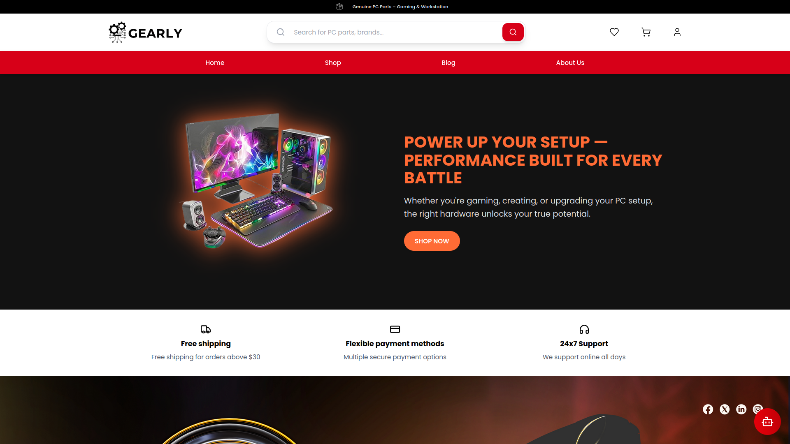

# Gearly - Online Gaming Gear Store 

> [Repository Link](https://github.com/phuchoang2005/Gearly.git)

Gearly is a comprehensive online technology platform designed to facilitate the buying and selling of both gaming gear. Built with **Spring Framework**, **ReactJS**, and **MongoDB**, it offers users a seamless shopping experience, from browsing the catalog to purchasing via **MoMo**. The platform also supports user registration, login, order tracking, reviews, and administrative management.



## Features

### User Features
- **Authentication:** Register, login, and email verification.
- **Gear Browsing:** Search and filter gear by category, title, author, and more.
- **Favorites and Cart:** Add gear to favorites and shopping cart.
- **Order Management:** Track order status and history.
- **Payment Integration:** Secure payments via MoMo.
- **Reviews and Ratings:** Post and view reviews for gears.

### Admin Features
- **User Management:** Manage user accounts and roles.
- **Gear Management:** Add, update, and delete gear listings, either manually or via CSV.
- **Order Processing:** View and manage orders efficiently.
- **Review Moderation:** Approve or reject reviews.
- **Business Insights:** Dashboard for tracking sales and user activity.

## Technology Stack
- **Backend:** Spring Framework, MongoDB
- **Frontend:** React, Tailwind CSS
- **Payment Integration:** MoMo
- **Data Handling:** REST APIs, JWT for authentication
- **Deployment:** Docker, GitHub

# Database Scripting
To use the application more cheerfully, it's recommended that we should import the json data to MongoDB from the directory below:
```bash
backend/src/main/java/com/dominator/bookify/data
```

## Installation
1. Clone the repository:
```bash
git clone https://github.com/phuchoang2005/Gearly.git
```
2. Navigate to the project directory:
```bash
cd Gearly
```
3. Install backend dependencies:
```bash
cd backend
mvn install
```
4. Install frontend dependencies:
```bash
cd frontend
npm install
```
5. Start the backend server:
```bash
mvn spring-boot:run
```
6. Start the frontend server:
```bash
npm run dev
```
7. Access the application at:
```bash
http://localhost:5173
```
